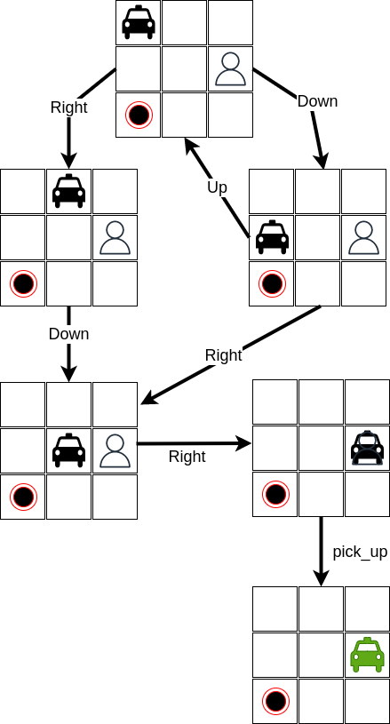
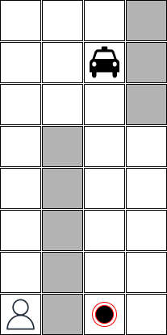

# Problem-solving searching review

Problem-solving search is a process of finding a solution to a problem by systematically exploring possible solutions and eliminating those that don't meet the requirements. It is used in artificial intelligence to solve complex problems that require a combination of data, and reasoning. The goal of a problem-solving search is to find the optimal solution, which is the solution that best meets the desired criteria. 

The search process involves representing the problem as a **state space**, defining the **initial state** and the **goal state**, and then using algorithms to explore possible solutions by moving from one state to another until the goal state is reached. The choice of algorithm depends on the specific problem, the size of the state space, and the desired time and memory complexity of the solution.

## Algorithms

There are several types of algorithms used in a problem-solving search:

* **Uninformed Search Algorithms**: These algorithms do not use any information about the problem and search blindly through the state space. Examples include Breadth-First Search (BFS), Depth-First Search (DFS), and Depth-Limited Search.

* **Informed Search Algorithms**: These algorithms use information about the problem, such as heuristics, to guide the search process and make it more efficient. Examples include A* Search, and Greedy Search.

* **Local Search Algorithms**: These algorithms are used to find a local optimum solution, rather than a globally optimum solution. They are often used in optimization problems where finding the global optimum is too time-consuming or computationally expensive. Examples include Hill Climbing, Simulated Annealing, and Genetic Algorithms.

Each of these algorithms has its own strengths and weaknesses, and the choice of algorithm depends on the specific problem, the size of the state space, and the desired time and memory complexity of the solution.

## References

Some references that maybe be useful:

* [Lecture 4: Search: Depth-First, Hill Climbing, Beam from MIT Open Courseware](https://ocw.mit.edu/courses/6-034-artificial-intelligence-fall-2010/resources/lecture-4-search-depth-first-hill-climbing-beam/)

* [Lecture 5: Search: Optimal, Branch and Bound, A*](https://ocw.mit.edu/courses/6-034-artificial-intelligence-fall-2010/resources/lecture-5-search-optimal-branch-and-bound-a/)

## A Taxi Driver Agent without Reinforcement Learning

In this exercise, you must implement a *taxi driver* agent that can pick up a passenger at one point and leave this passenger at another point considering a specific map. An example of a map is presented below: 


This map is a very simple one. This map has only 3 columns and 3 rows, without any barrier. The taxi is in position [0,0], the passenger is in position [1,2], and the passenger must be taken at [2,0].

We know that the taxi agent can execute the following actions:

* **go down**: The result of executing this action is to move the taxi to one row down;
* **go up**: The result of this action is to move the taxi one row up;
* **go right**: The result of this action is to move the taxi one column right;
* **go left**: The result of this action is to move the taxi onde column left;
* **pick up passenger**: The taxi only can perform this action if it is at the same position as the passenger and the passenger is not inside the taxi. After the execution of this action, the passenger will be inside the taxi;
* **leave passenger**: The agent only can perform this action if the passenger is inside the taxi. The result of performing this action is to leave the passenger at the same position as the taxi. 

A sub-set of space state for this problem can be represented as follow: 



A possible solution for this problem is: 

```
right; down; right; right; pick_up; down; left; left; leave
```

**How can we implement a piece of software which finds an optimal solution for this problem considering any initial state?** 


This software must be able to handle different configurations with different dimensions. For example, the images below show different initial states:

This image has barriers:


This state represents a situation where the passenger is inside the taxi:

 

This state has a bigger number of barriers: 


## Before starting the implementation

Before starting the implementation, you must answer some questions:

* What is relevant to represent in each state in the world? Which data structures are good to represent these states? Which is the meaning of each variable? 

* Which are the actions that the agent can perform? How do those actions change the states? 

* Which search algorithm is good to solve this problem? Is any heuristics necessary? 

* Which are the limits of your solution? Is this solution able to solve any map? 

## Requirements

* Each group must deliver an implementation, the test files using `pytest` and a README.md file that explains how this implementation works.

* Your implementation must receive the map configuration as a text file.

* The test files must consider the scenarios described above and also the maps illustrated below:  




## Hints

* You must define the data structure to represent each state. Use only variables that are relevant to solve this problem. If you use unnecessary attributes this will increase the search space.
* You must define how the actions will change the state representation. Try to avoid generating useless states - this also may increase the search space.
* Start your implementation with the simplest configurations. 
* There are a lot of implementations of uninformed and informed search algorithms available on the Internet. Try to reuse one of them.

## Delivery

* This exercise must be done by a group of maximum 3 students. 

* The **deadline is 02/21/2023 20:00 -0300.**

* The implementation must be delivered through *Github classroom*. This is the link [https://classroom.github.com/a/bFRDDmcO](https://classroom.github.com/a/bFRDDmcO). 
 
