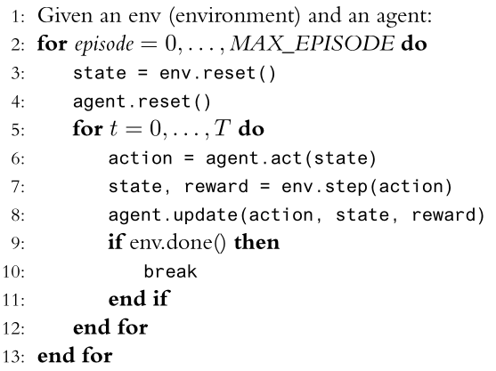

# Ferramentas e ambientes para aprendizagem por reforço

De acordo com a [Farama Foundation](https://farama.org/), a aprendizagem por reforço é uma abordagem popular para a IA, onde um agente aprende a tomar ações sequenciais em um ambiente por tentativa e erro. A aprendizagem por reforço é conceitualizada como um loop onde o agente observa o estado de seu ambiente e, em seguida, toma uma ação que muda esse estado. No momento de receber a próxima observação, o agente também recebe uma recompensa associada à ação mais recente. Esse processo continua em um ciclo, e durante a aprendizagem, o agente procura maximizar sua recompensa média esperada. Na prática, os ambientes são mais frequentemente um pedaço de software como um jogo ou simulação.

Exemplo de trecho de código para treinar um agente em um ambiente de aprendizagem por reforço:

```python
import gymnasium as gym
env_name = "CartPole-v1"
env = gym.make(env_name).env

done = False
episodios = 1000

for i in range(episodios):
    state = env.reset()
    while not done:
        action = select_action(state)
        next_state, reward, done, truncated, info = env.step(action)
```
Em aprendizagem supervisionada, a pilha de software básica geralmente tem apenas três componentes: 

* o conjunto de dados, 
* o pré-processamento do conjunto de dados, e 
* o algoritmo de aprendizado. 

Na aprendizagem por reforço, a pilha de software é mais complexa. Começa com a construção do próprio ambiente, geralmente um pedaço de software como uma simulação. A lógica do ambiente base é então envolvida com uma API à qual o código de aprendizado pode ser aplicado. Dependendo de como o algoritmo de aprendizado por reforço interage com o ambiente, camadas de pré-processamento são então aplicados (por exemplo, para tornar as observações de imagem em escala de cinza). Somente depois que tudo isso é feito, um algoritmo de aprendizado por reforço pode ser aplicado.

## Atividade pré-aula

1. Acesse o [Gymnasium API](https://gymnasium.farama.org/) e leia a documentação.
1. Instale o Gymnasium API na sua máquina. Em outras palavras, crie um projeto, com ambiente virtual, e instale o Gymnasium API.
1. Leia a documentação dos ambientes Taxi Driver e Cliff Walking que fazem parte dos *Toy Text* environments.
1. Implemente o loop genérico de treinamento, discutido na última aula, para entender como os ambientes Taxi Driver e Cliff Walking funcionam.



Alguns comandos deste pseudo-código não poderão ser implementados, por exemplo, a linha 8. Pois ainda não vimos nenhum algoritmo de aprendizagem por reforço. No entanto, é possível, por exemplo, apenas armazenar as experiências em um arquivo de log - isto irá ajudar a entender o que acontece no ambiente. 

Tem algumas instruções que não estão explícitas no pseudo-código acima, por exemplo, como o agente seleciona uma ação depois da inicialização do ambiente? 

Tais questões vão ser discutidas na próxima aula. 

## Principais referências

1. [The Farama Foundation](https://farama.org/Announcing-The-Farama-Foundation).
1. How to use [Gymnasium API](https://gymnasium.farama.org/): a Python library for single agent reinforcement learning.
1. [PettingZoo](https://pettingzoo.farama.org/): a Python library for multi-agent reinforcement learning.
1. [SuperSuit](https://github.com/Farama-Foundation/SuperSuit): wrappers for RL environments. 

## Outras ferramentas

1. [Worldgen](https://openai.com/blog/emergent-tool-use/): ambiente de aprendizagem por reforço para treinar agentes em ambientes multi-agents (competitivos e cooperativos) em um espaço 3D.
