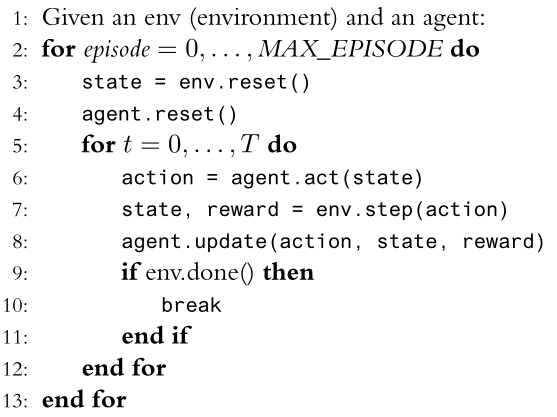

# Reinforcement Learning: Tools and Environments

??? warning "Important!"
    This is a material that you must use to do the code activities of this class. We will not cover this material in the lecture, but you will need it to do the activities. So, please read it carefully.

According to the [Farama Foundation](https://farama.org/), reinforcement learning is a popular approach to AI, where an agent learns to take sequential actions in an environment through trial and error. Reinforcement learning is conceptualized as a loop where the agent observes the state of its environment and then takes an action that changes that state. Upon receiving the next observation, the agent also receives a reward associated with the most recent action. This process continues in a cycle, and during learning, the agent seeks to maximize its expected average reward. In practice, environments are more often a piece of software such as a game or simulation.

The code bellow is an example of how to train an agent in a reinforcement learning environment using the Gymnasium API:

```python
import gymnasium as gym
env_name = "CartPole-v1"
env = gym.make(env_name).env

done = False
episodios = 1000

for i in range(episodios):
    state = env.reset()
    while not done:
        action = select_action(state)
        next_state, reward, done, truncated, info = env.step(action)
```

In supervised learning, the basic software stack typically has only three components: 

* the dataset, 
* the preprocessing of the dataset, and 
* the learning algorithm. 

However, in reinforcement learning, the software stack is more complex. It starts with the construction of the environment itself, which is often a piece of software such as a simulation. The base environment logic is then wrapped with an API to which the learning code can be applied. Depending on how the reinforcement learning algorithm interacts with the environment, layers of preprocessing are then applied (e.g., to make image observations grayscale). Only after all this is done can a reinforcement learning algorithm be applied.

## Activity

1. Access the [Gymnasium API](https://gymnasium.farama.org/) and read the documentation.
2. Install the Gymnasium API on your machine. In other words, create a project with a virtual environment and install the Gymnasium API.
3. Read the documentation for the *Taxi Driver* and *Cliff Walking* environments that are part of the *Toy Text* environments.
4. Implement the generic training loop, presented below and discussed in the last class, to understand how the *Taxi Driver* and *Cliff Walking* environments work.



5. The line 4 is unnecessary. You can simply ignore it.
6. Implement for line 8: `agent.update(action, state, reward)` a logging to some log file for recording experiences.
7. The script should consider both environments. However, if you prefer, you can implement two scripts, one for each environment. Or implement a script that takes the name of the environment as a command-line argument.
8. Keep this code saved somewhere because you will need it for the next classes.

### Questions

1. How are states represented in these two environments?
2. What are the possible actions in these two environments?
3. How are rewards given in these two environments?

## References

1. [The Farama Foundation](https://farama.org/Announcing-The-Farama-Foundation).
1. How to use [Gymnasium API](https://gymnasium.farama.org/): a Python library for single agent reinforcement learning.
1. [PettingZoo](https://pettingzoo.farama.org/): a Python library for multi-agent reinforcement learning.
1. [SuperSuit](https://github.com/Farama-Foundation/SuperSuit): wrappers for RL environments. 
1. [Worldgen](https://openai.com/blog/emergent-tool-use/): environment for reinforcement learning to train agents in multi-agent environments (competitive and cooperative) in a 3D space.