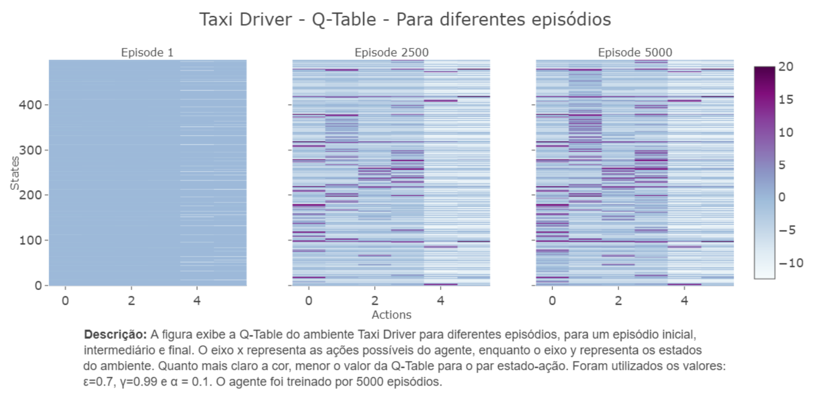

# Hiperparâmetros em Q-Learning

Antes de iniciar esta atividade, leia o material sobre [avaliação de algoritmos de aprendizado por reforço](../11_evaluation/index.md).

## Manipulando $\alpha$ e $\gamma$

Ainda considerando o exemplo a implementação do `TaxiDriver`, responda as perguntas abaixo.

* O que é melhor? Um valor de $\alpha$ muito próximo de zero ou um valor de $\alpha$ muito próximo de um?
* O que é melhor? Um valor de $\gamma$ muito próximo de zero ou um valor de $\gamma$ muito próximo de um?

Execute treinamentos considerando valores de $\alpha$ e $\gamma$ próximos de zero, intermediários e próximos de um. Armazene os dados sobre reward acumulado ou qualquer outra métrica que você considere relevante e crie gráficos para comparar os resultados.

O importante é comparar a curva de aprendizado para diferentes valores de $\alpha$ e $\gamma$ e saber dizer se o agente aprendeu ou não a tarefa. Ao variar o $\alpha$ você deve fixar o valor de $\gamma$ e vice-versa. Fica a seu critério quais valores fixos de $\alpha$ e $\gamma$ você vai escolher.

## Considerando uma escolha de ação sempre aletatória

O que acontece se a escolha das ações em cada estado for sempre aleatória? Ou seja, se a função `select_action` ao invés de ser definida como abaixo:

````python
def select_action(self, state):
    rv = random.uniform(0, 1)
    if rv < self.epsilon:
        return self.env.action_space.sample() # Explore action space
    return np.argmax(self.q_table[state]) # Exploit learned values
````

É definida assim:

````python
def select_action(self, state):
    return self.env.action_space.sample() # Explore action space
````

Qual o comportamento do agente? **Novamente**: use gráficos para justificar a sua resposta.  

## Considerando um agente que nunca explora novas ações

O que acontece se a escolha das ações em cada estado for sempre buscando a melhor ação? Ou seja:

````python
def select_action(self, state):
    return np.argmax(self.q_table[state]) # Exploit learned values
````  

## Atividade

Nesta atividade você deve responder as seguintes perguntas: 

* O que é melhor? Um valor de $\alpha$ muito próximo de zero ou um valor de $\alpha$ muito próximo de um?
* O que é melhor? Um valor de $\gamma$ muito próximo de zero ou um valor de $\gamma$ muito próximo de um?
* Qual é o impacto ao escolher uma ação sempre de forma aleatória durante o treinamento? 
* Qual é o impacto ao escolher uma ação sempre considerando a Q-table durante o treinamento?

Para responder estas perguntas você deve considerar o processo de aprendizado do agente e o resultado final do treinamento.

Um documento PDF com imagens e legendas deve ser entregue via Blackboard até o dia **13/02/2025**. A atividade já foi criada no Blackboard e o nome dela é *Exercício 2*. Esta atividade é individual.

### Rubrica de avaliação

| Conceito | Descrição |
|:---------|:----------|
| A+       | Respondeu todas as perguntas com gráficos de alta qualidade e que sumarizam diversos experimentos da forma como é descrito no documento sobre [avaliação de agentes](../11_evaluation/index.md) |
| B        | Respondeu todas as perguntas, mas com gráficos que tem algum tipo de defeito, tal como, falta de legenda, legenda errada, qualidade da imagem baixa, falta de informações sobre os eixos, entre outros problemas |
| C        | Respondeu parcialmente as perguntas |


<!--

## Um exemplo de gráfico muito bem feito :new: 

Seguem abaixo exemplos de gráficos bem formatados e completos. 

Exemplo de gráfico com a evolução do aprendizado do agente. Este gráfico foi feito pela Letícia em 2023/1. 

<center>

</center>

Exemplo de gráfico com a evolução da *Q-table*. Este gráfico foi feito pelo Giancarlo em 2023/1.

<center>

</center>

-->