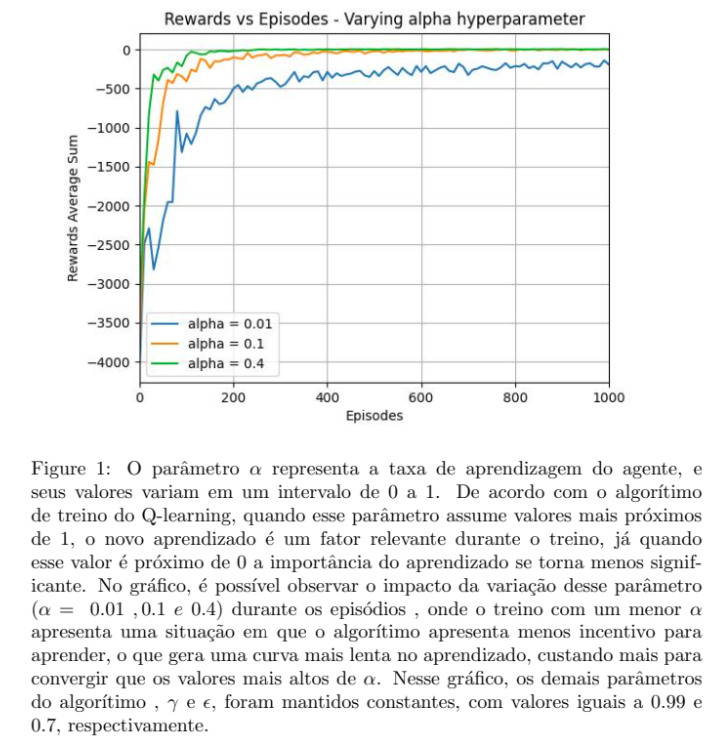

# Hiperparâmetros em Q-Learning

Ainda considerando o exemplo a implementação do `TaxiDriver`, responda as perguntas abaixo.

Para responder as questões abaixo utilize as implementações do `TaxiDriverGym.py` e `QLearning.py` que você implementou na atividade anterior.

## Manipulando $\alpha$ e $\gamma$

* Se $\alpha$ for um valor muito próximo de zero? Explique o comportamento encontrado.

* Se $\gamma$ for zero? Explique o comportamento encontrado. 

Para fundamentar a sua resposta, use os plots gerados na pasta `results` depois do treinamento. 

## Considerando uma escolha de ação sempre aletatória

O que acontece se a escolha das ações em cada estado for sempre aleatória? Ou seja, se a função `select_action` ao invés de ser definida como abaixo:

````python
def select_action(self, state):
    rv = random.uniform(0, 1)
    if rv < self.epsilon:
        return self.env.action_space.sample() # Explore action space
    return np.argmax(self.q_table[state]) # Exploit learned values
````

É definida assim:

````python
def select_action(self, state):
    return self.env.action_space.sample() # Explore action space
````

Qual o comportamento do agente? **Novamente**: use os plots gerados na pasta `results` depois do treinamento para fundamentar a sua resposta. 

## Considerando um agente que nunca explora novas ações

O que acontece se a escolha das ações em cada estado for sempre buscando a melhor ação? Ou seja:

````python
def select_action(self, state):
    return np.argmax(self.q_table[state]) # Exploit learned values
````  

## Sumarizando os resultados através de imagens

Como podemos sumarizar os diferentes resultados através de imagens?

Neste momento, você já deve ter percebido que uma ferramenta muito útil para visualizar e sumarizar o aprendizado do agente são gráficos que mostram a evolução de alguma métrica ao longo dos diversos episódios.

* Quais foram as métricas utilizadas no caso do `TaxiDriver`?

* Quais foram os hiperparâmetros utilizados? 

* O aprendizado dos agentes implementados para este caso **convergem** rapidamente? 

* O **desempenho** do agente se mantem ao longo dos episódios? 

## Atividade

Faça uso de uma única imagem para sumarizar o aprendizado do agente. Você deve escolher a melhor métrica para o eixo $y$ do gráfico. O eixo $x$ deve ser a quantidade de episódios utilizado no treinamento. Você também deve definir qual é o melhor *zoom* (foco) no gráfico. Crie um documento que tem esta única imagem e a legenda dela.

Na legenda é necessário ter o título da imagem e um texto explicativo. O texto explicativo pode ser longo e deve ter as informações sobre os hiperparâmetros utilizados. 

O gráfico deve possuir 3 linhas distintas. Cada uma destas linhas deve apresentar uma variação possível considerando os hiperparâmetros $\alpha$, $\gamma$ e $\epsilon$. Deverá ficar a critério do estudante quais valores utilizar. 

Um exemplo de imagem que sumariza dados ou apresenta resultados de experimentos é apresentada abaixo: 


Todas as informações relevantes para entender o resultado do treinamento precisam estar auto-contidas na imagem e na legenda da imagem. 

Um documento com esta imagem e legenda deve ser entregue via Blackboard até o dia **29/02/2023**. A atividade já foi criada no Blackboard e o nome dela é *Exercício 4*. Esta atividade é individual.

## Rubrica de avaliação

| Conceito | Descrição |
|:---------|:----------|
| A+       | Entregou uma única imagem com legenda. O texto da legenda possui toda a informação necessária para entender os resultados alcançados pelo experimento. A imagem é uma imagem que consegue mostrar a diferença entre os hiperparâmetros escolhidos |
| C        | Não entregou uma única imagem |

<!--
## Um exemplo de gráfico muito bem feito :new: 

Segue abaixo um exemplo de gráfico muito bem formatado e completo. Este gráfico foi feito pela Letícia. 

<center>

</center>
-->