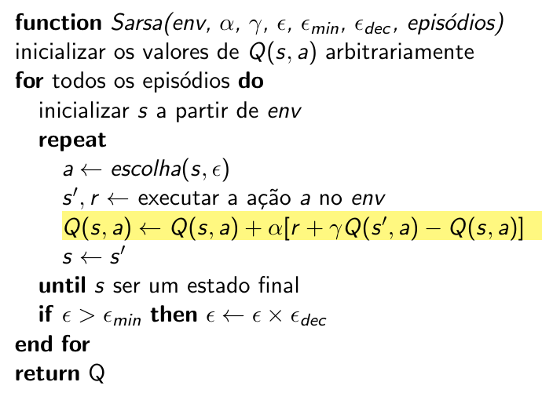

# SARSA Algorithm: on-policy approach
    
## Definition and key concepts

The updating rule in **Q-Learning** is as follows:

$$
Q(s,a) \leftarrow Q(s,a) + \alpha [r +\gamma \max_{A'}{Q(s', A')} - Q(s,a)]
$$

The difference between the new sample and the old estimation is used to update the old estimation. The **Q-Learning** algorithm considers the value of the new sample as the maximum $Q$ possible value in state $s'$: 

$$
\max_{A'}{Q(s', A')}
$$

However, the action with maximum $Q$ possible value may not be the actual action the agent will take in the future because with $\epsilon$ probability the agent will take a random action. In other words, the action used to update policy in **Q-Learning** is different from the true action the agent will take. This is the reason why **Q-Learning** is called an **off-policy** algorithm. 

On the other hand, the State-Action-Reward-State-Action (**SARSA**) algorithm is **on-policy** because it updates the Q-table with:

$$
Q(s,a) \leftarrow Q(s,a) + \alpha [r +\gamma Q(s', a') - Q(s,a)]
$$

it updates $Q(s,a)$ considering the real action executed by the agent.

Sarsa algorithm is very similar to Q-Learning algorithm:



## Implementation

The goal of this activity is to verify if we understood how to implement the **Sarsa** algorithm and grasp the practical differences between **Sarsa** and **Q-Learning**.

First, you must **implement the Sarsa algorithm**. You can start from the `QLearning.py` file, make a copy, change the name :smiley:, and change what is necessary.  

Then, you must **apply the Sarsa implementation to solve the taxi-driver problem**. Compare the Sarsa results with the Q-Learning results. Compare the training curve and the agent's behavior after the training. You can use the same file `TaxiDriverGym.py`, but remember to change the output file names (*.csv and plot).  

The third activity of this implementation is **applying Q-Learning and Sarsa algorithms in a different environment**: the [Cliff Walking](https://gymnasium.farama.org/environments/toy_text/cliff_walking/). This is still a very simple environment. However, when you apply those algorithms in this type of environment you can see the differences between those algorithms and identify any bug in your implementation if exists.

In order to train your agent for the Cliff Walking problem you must setup the environment like this: 

```python
env = gym.make("CliffWalking-v0").env
```

After the training phase, to see the behavior, you must code something like this: 

```python
env = gym.make("CliffWalking-v0", render_mode="human").env

(state, _) = env.reset()
rewards = 0
actions = 0
done = False
    
while not done:
    print(state)
    action = np.argmax(q_table[state])
    state, reward, done, truncated, info = env.step(action)

    rewards = rewards + reward
    actions = actions + 1

print("\n")
print("Actions taken: {}".format(actions))
print("Rewards: {}".format(rewards))
```

Setting the `render_mode` equal to `human` will allow you to see an animation.

The final activity of this implementation is to create a `README.md` file and answer the following questions: 

* Which algorithm has the best results for the taxi-driver environment? 

* Which algorithm has the best results for the Cliff Walking environment? 

* Try to explain the results. Why one algorithm is better than another? 

* Do a small research about **Sarsa** algorithm to understand its cons and pros. 

<!-- para a proxima versao eu preciso definir melhor a rubrica de avaliacao
A+ ou A = somente para os trabalhos que apresentam as curvas de aprendizagem e o resultado final do agente para dar base as suas respostas.
B = para aqueles que implementaram tudo e responderam as perguntas sem utilizar as curvas de aprendizagem como base para a resposta. 
C = para aqueles que só implementaram
D = para aqueles que implementaram parcialmente
-->

## Delivery

Put all those files in the same project and then submit them to [https://classroom.github.com/a/gTxejAeH](https://classroom.github.com/a/gTxejAeH). This activity is individual and the **deadline is 03/07/2023 20:00 -0300.**


<!-- usar este texto https://www.baeldung.com/cs/q-learning-vs-sarsa para comentar os resultados do cliff walking e as diferencas entre os algoritmos -->

