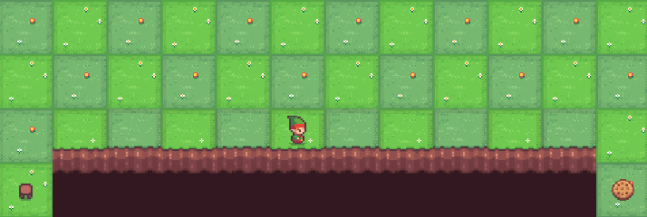
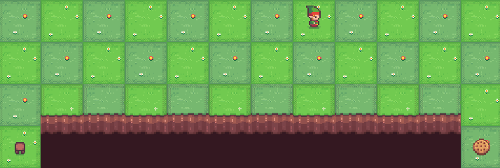

# Comentários sobre as implementações do Q-Learning e Sarsa

[Análise dos treinamentos do Q-Learning e Sarsa](./analise_treinamento.html)

Agente treinado com Q-Learning no ambiente CliffWalking:

Agente treinado com Sarsa no ambiente CliffWalking:

## QLearning vs  Sarsa - Vantagens e Desvantagens 📌️ 

- `QLearning`

$$Q(S_t, A_t) = Q(S_t, A_t) + \alpha[R_{t+1} + \gamma max(Q(S_{t+1}, a)) - Q(S_t, A_t) ]$$

Algorítimo que busca encontrar a melhor ação a ser tomada, dado um estado atual. 

É considerao um algoríitmo **off-policy**, pois a melhor ação é escolhida para a atualização da **q_table** mesmo que essa ação não seja aplicada nessa ocasião (fator de aleatoriedade na tomada de uma ação - **Explore**).

Como o QLearning aprende com a "política ótima", ele é considerado um algorítimo mais "agressivo". Ou seja, No exemplo do ambiente CliffWalking o QL seguirá o caminho mais curto, pois esse é o caminho ótimo, mesmo que haja risco maior de queda.

- `Sarsa`

$$Q(S_t, A_t) = Q(S_t, A_t) + \alpha[R_{t+1} + \gamma Q(S_{t+1}, A_{t+1}) - Q(S_t, A_t) ]$$

Como é possível observar pela formula, o algorítimo SARSA aprende com uma política "quase ótima". Um agente treinado com o algorítimo SARSA interage com o ambiente atualizando **q_table** com base nas ações efetivamente tomadas. Quando o problema envolve achar a solução ótima ou quando o número mínimo de ações deve ser tomada na resolução do problema, o algorítimo SARSA pode não se apresentar como a melhor escolha.

