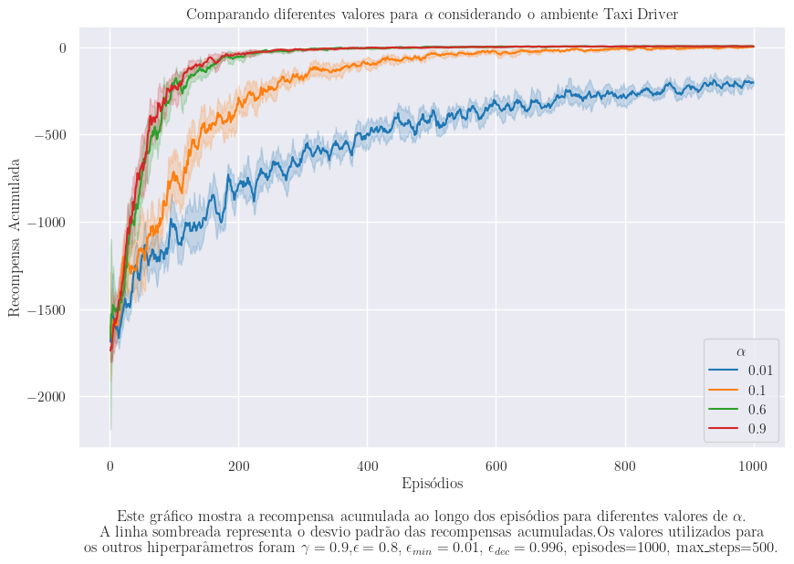
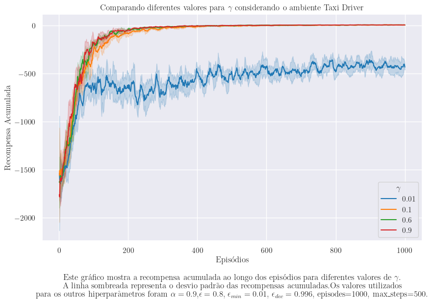
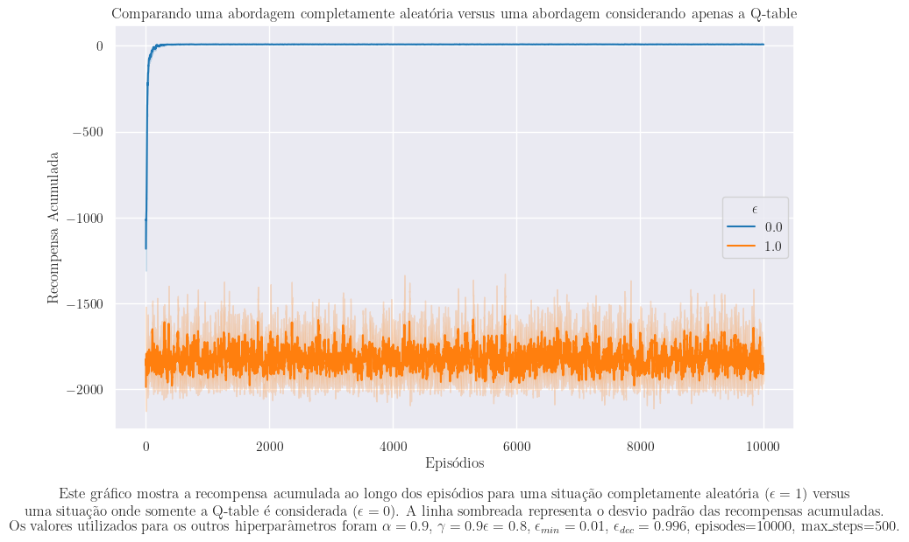

# Alguns comentários sobre as entregas

## O que é melhor? Um valor de $\alpha$ muito próximo de zero ou um valor de $\alpha$ muito próximo de um?

Na figura abaixo é apresentado a curva de aprendizado do agente considerando diferentes valores para o parâmetro $\alpha$. 

Na tabela abaixo são apresentadas as quantidades de ações média por episódio considerando diferentes valores para o parâmetro $\alpha$. Para o cálculo destes valores foram executadas 100 simulações depois da Q-table preenchida. 

| $\alpha$ | Ações média por episódio | Desvio padrão |
|----------|---------------------------|---------------|
| 0.9 | 24.459 | 74.62 |
| 0.6 | 28.195 | 84.43 |
| 0.1 | 293.635 | 241.517 | 
| 0.01 | 500 | 0.0 | 

Os valores apresentados acima são os valores referente a inferência do agente. Idealmente, um agente deveria gastar entre 11 e 17 ações por episódio neste ambiente. Os valores apresentados acima parecem altos. Isto indica que mesmo o modelo onde $\alpha = 0.9$ não está convergindo para o ótimo.

??? hint "O que podemos fazer?"
    Uma alternativa para melhorar a convergência do modelo é aumentar o número de episódios, por exemplo, para 10.000. 

    Neste caso, o valor médio de ações por episódio é de 13.105 com um desvio padrão de 2.61.

## O que é melhor? Um valor de $\gamma$ muito próximo de zero ou um valor de $\gamma$ muito próximo de um?

## Qual é o impacto ao escolher uma ação sempre de forma aleatória durante o treinamento ou sempre considerando a Q-table? 

Na figura abaixo é apresentado a curva de aprendizado do agente considerando um cenário onde as ações são sempre escolhidas de forma aleatória durante o treinamento e um cenário onde as ações são sempre escolhidas considerando a Q-table.

Na tabela abaixo são apresentadas as quantidades de ações média por episódio considerando os diferentes cenários. 

| Escolha das ações | Ações média por episódio | Desvio padrão |
|----------|---------------------------|---------------|
| Aleatória | 13.051 | 2.703 |
| Q-table | 13.219 | 2.574 |

??? hint "Qual a explicação para os resultados apresentados?"
    Segundo a literatura, a forma como as ações são escolhidas durante o treinamento não impacta na convergência do modelo.

    A única implicação prática é o fato do treinamento ser mais rápido quando as ações são escolhidas usando exploration e exploitation.