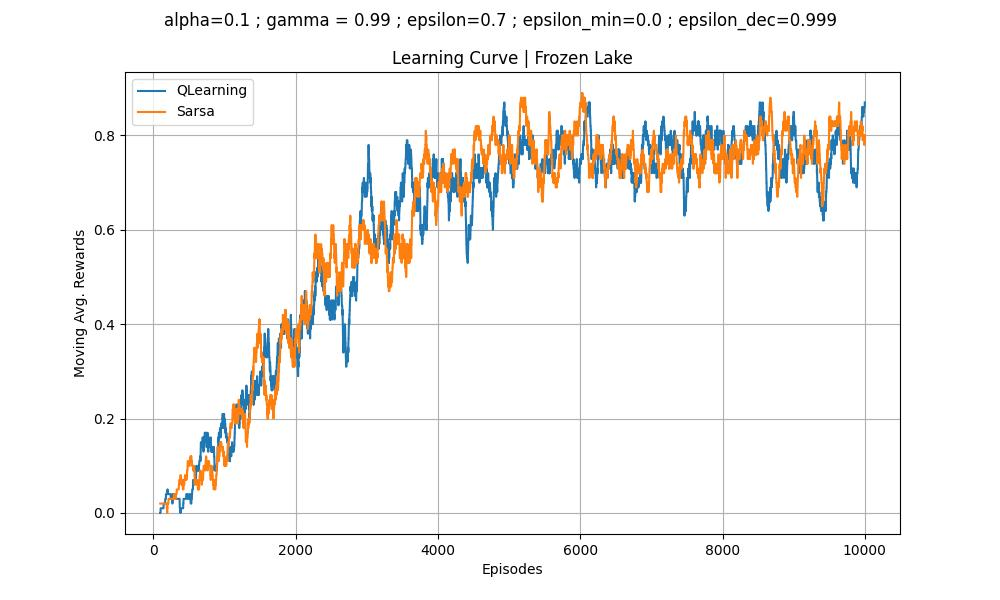
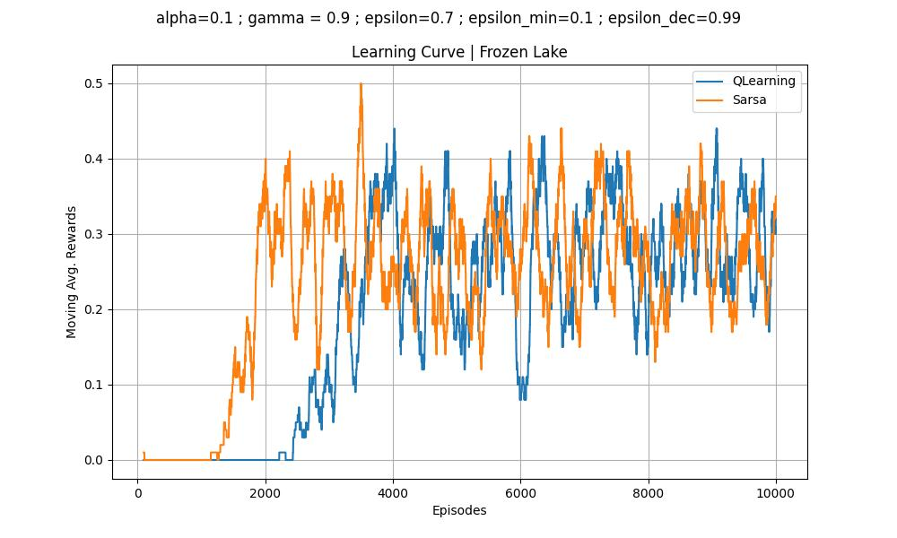

# Comentários sobre as entregas referentes ao ambiente Frozen Lake. 

Seguem exemplos de resultados bem apresentados. 

## Um exemplo de resultado onde o agente aprendeu a tarefa

## Um exemplo de resultado onde o agente não aprendeu a tarefa

## Alguns hiperparâmetros utilizados e com bons resultados

| Algoritmo                  | alpha (α) | gamma (γ) | epsilon (ε) | epsilon min | epsilon dec | episódios | Tamanho | Resultado (%) |
|----------------------------|-----------|-----------|-------------|-------------|-------------|-----------|---------|---------------|
| QLearning (Melhor)         | 0.07      | 0.98      | 0.98         | 0.0001      | 0.9996      | 20_000    | 4x4     | 0.866         |
| QLearning (Segunda Melhor) | 0.03      | 0.98      | 0.98         | 0.0001      | 0.9996      | 20_000    | 4x4     | 0.858         |
| SARSA (Melhor)             | 0.03      | 0.98      | 0.98         | 0.0001      | 0.9996      | 20_000    | 4x4     | 0.814         |
| SARSA (Segunda Melhor)     | 0.05      | 0.95      | 0.95       | 0.0001      | 0.9996      | 20_000    | 4x4     | 0.808         |

Estes valores foram obtidos pelos alunos Ricardo Rodrigues e Pedro Henrique no 1o semestre de 2024.
