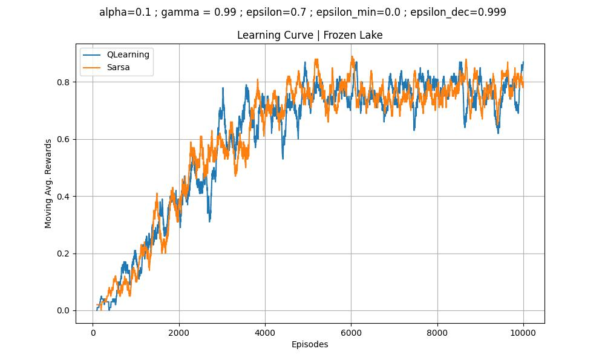
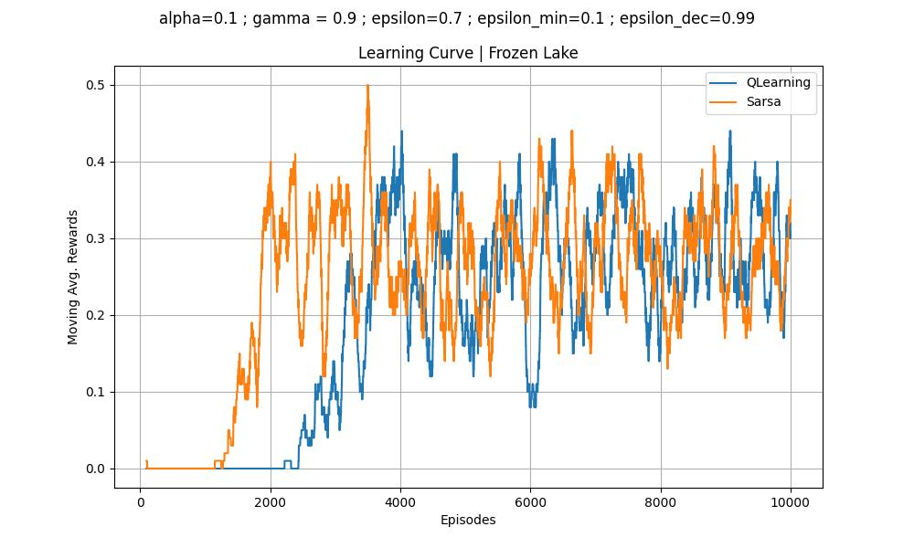
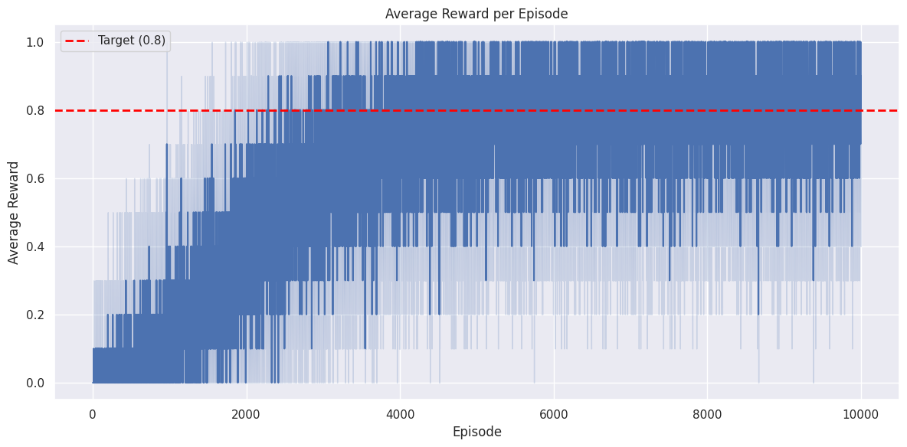
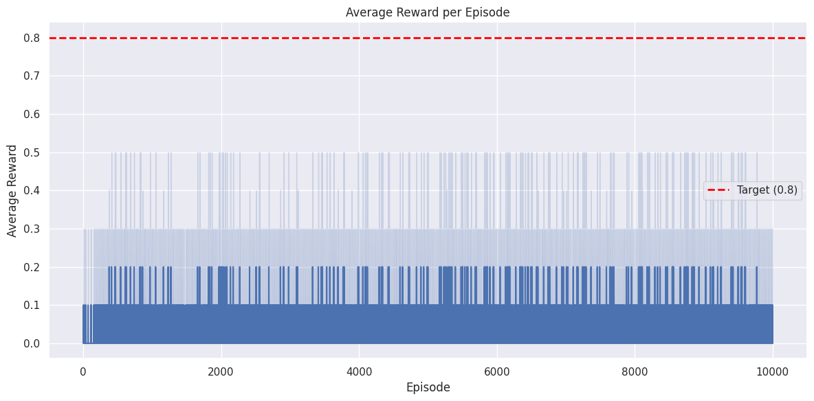
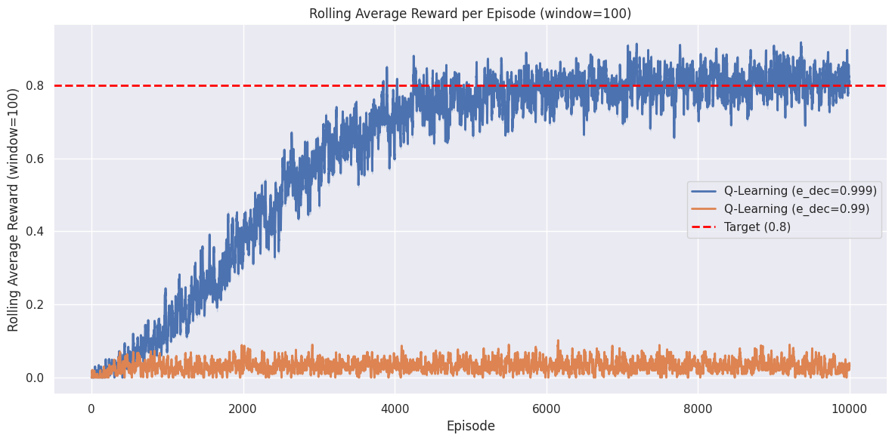
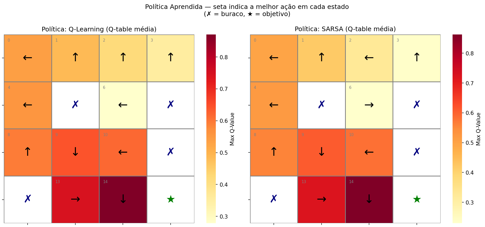

# Comentários sobre as entregas referentes ao ambiente Frozen Lake. 

Seguem exemplos de resultados bem apresentados. 

## Um exemplo de resultado onde o agente aprendeu a tarefa



## Um exemplo de resultado onde o agente não aprendeu a tarefa



## Validação final do modelo

Para validar o modelo treinado, foi utilizado o código abaixo: 

```python
import gymnasium as gym
import numpy as np
from numpy import loadtxt

env = gym.make('FrozenLake-v1', render_mode='ansi').env
q_table = loadtxt('data/q-table-frozen-lake-qlearning_conf1.csv', delimiter=',')

rewards_list = []
for j in range(0,100):
    rewards = 0
    for i in range(0,100):    
        (state, _) = env.reset()
        done = False
        while not done:
            action = np.argmax(q_table[state])
            state, reward, done, _, info = env.step(action)
        rewards += reward
    rewards_list.append(rewards)

print(f'média = {np.mean(rewards_list)}, desvio padrão = {np.std(rewards_list)}')
```

Para a primeira opção de configuração de hiperparâmetros, o resultado foi:

```
média = 82.68, desvio padrão = 3.5408473562129164
```

Para a segunda opção: 

```
média = 5.22, desvio padrão = 1.967638178121171
```

Reforçando que a segunda configuração não foi capaz de aprender a tarefa.

Inclusive, o problema da segunda configuração está no valor de $\epsilon_{dec}$ que é muito alto. Se mudarmos o valor para 0.999, o resultado melhora:

```
média = 78.93, desvio padrão = 4.667451124543244
```


## Algumas considerações sobre a apresentação da curva de aprendizagem

O método correto para gerar e apresentar a curva de aprendizagem é treinar o agente várias vezes em *N* episódios, e para cada episódio, calcular a média de recompensa obtida em um número fixo de testes (por exemplo, 10 testes). No entanto, em alguns casos, a apresentação desta curva de aprendizagem pode não ficar tão boa, especialmente em ambientes onde o reward acumulado pode variar muito entre os episódios, como é o caso do Frozen Lake.

Por exemplo, veja como fica a curva para um algoritmo Q-learning com alpha=0.1, gamma=0.99, epsilon=0.8, epsilon_min=0.0, **epsilon_dec=0.999**, episodes=10_000, tamanho=4x4:



E para um algoritmo Q-Learning com alpha=0.1, gamma=0.99, epsilon=0.8, epsilon_min=0.0, **epsilon_dec=0.99**, episodes=10_000, tamanho=4x4:



Criar um plot com ambas as curvas para comparação iria gerar um gráfico muito poluído, o que não é interessante para a análise. 

Neste caso, uma alternativa interessante é apresentar a curva de aprendizagem utilizando uma média móvel da média, o que ajuda a suavizar as variações e torna a curva mais legível.



## Análise da política aprendida



Imagem gerada pelo Matheus Raffaelle Nery Castellucci. 

<!--

## Alguns hiperparâmetros utilizados e com bons resultados


| Algoritmo                  | alpha (α) | gamma (γ) | epsilon (ε) | epsilon min | epsilon dec | episódios | Tamanho | Resultado (%) |
|----------------------------|-----------|-----------|-------------|-------------|-------------|-----------|---------|---------------|
| QLearning (Melhor)         | 0.07      | 0.98      | 0.98         | 0.0001      | 0.9996      | 20_000    | 4x4     | 0.866         |
| QLearning (Segunda Melhor) | 0.03      | 0.98      | 0.98         | 0.0001      | 0.9996      | 20_000    | 4x4     | 0.858         |
| SARSA (Melhor)             | 0.03      | 0.98      | 0.98         | 0.0001      | 0.9996      | 20_000    | 4x4     | 0.814         |
| SARSA (Segunda Melhor)     | 0.05      | 0.95      | 0.95       | 0.0001      | 0.9996      | 20_000    | 4x4     | 0.808         |

Estes valores foram obtidos pelos alunos Ricardo Rodrigues e Pedro Henrique no 1o semestre de 2024.

-->