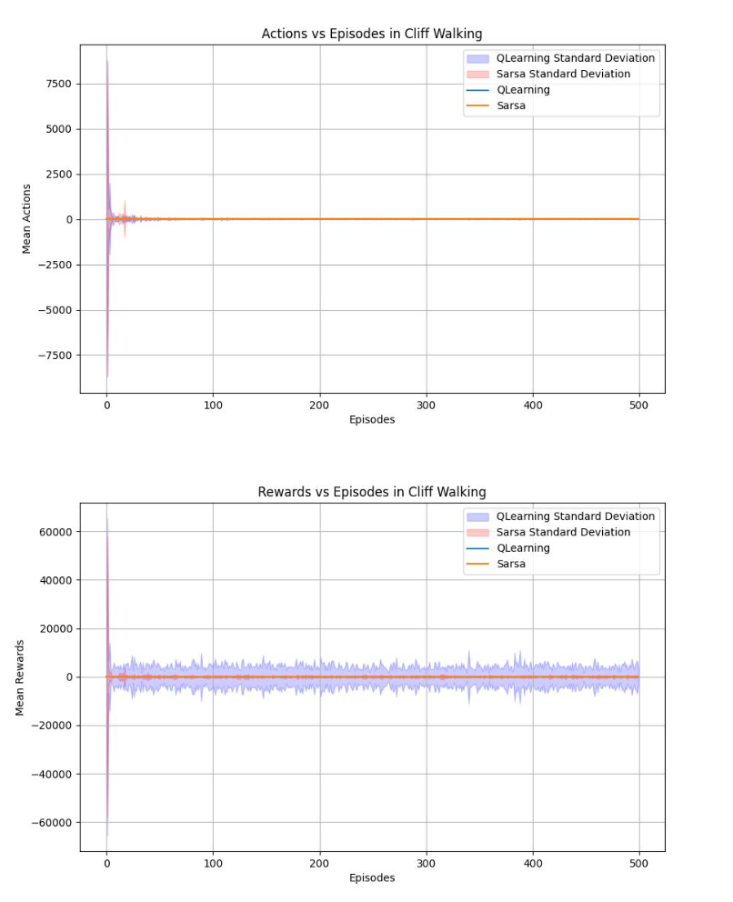

# Como avaliar o desempenho de um agente? 
    
O desempenho de um agente pode ser avaliado de diversas formas. A forma mais comum é através da curva de aprendizagem. A curva de aprendizagem mostra o desempenho do agente ao longo do tempo de treinamento. O desempenho pode ser medido em termos do objetivo de aprendizagem (e.g., retorno acumulado) bem como outras métricas secundárias.


Para gerar a figura acima da esquerda foi necessário executar o treinamento do agente N vezes com os mesmos hiperparâmetros, calculando a média e mostrando a variância via gráfico. No mesmo gráfico também é mostrado o retorno acumulado ótimo.

A figura acima do lado direito mostra outra métrica utilizada para acompanhar o aprendizado do agente. Neste caso, a métrica é a quantidade de passos necessários para o agente chegar no objetivo.

Abaixo são apresentados outros gráficos que ilustram o aprendizado do agente.


## Exercício: comparar Q-Learning e SARSA no ambiente do Cliff Walking

A proposta desta atividade é reutilizar o código já feito no [atividade sobre on-olicy e off-policy](./classes/05_x_sarsa/index.md#implementação) criando novos plots para apresentação dos resultados. 

Nesta atividade você deverá executar o treinamento 100 vezes para cada algoritmo (Q-Learning e Sarsa) e calcular a média e a variância do retorno acumulado e da quantidade de passos necessários para o agente chegar no objetivo.

Crie dois gráficos, comparando Q-Learning e Sarsa, como os apresentados acima. Um para o retorno acumulado e outro para a quantidade de passos necessários para o agente chegar no objetivo.

Utilize os seguintes hiperparâmetros:

```python
(
    alpha=X, 
    epsilon=0.1, 
    epsilon_min=0.1,
    epsilon_decay=1,
    gamma=Y
)
```

os valores de $\alpha$ e $\gamma$ devem ser escolhidos por você.

Uma sugestão para a implementação dos gráficos é utilizar a biblioteca `seaborn`. Considere um dataframe com as seguintes colunas: 

* algoritmo: Q-Learning ou Sarsa;
* episodio: número do episódio;
* retorno: retorno acumulado.

Execute `N` episódios em 100 treinamentos. Adicione todos os valores de episódio e retorno neste dataframe. Informe também qual é o algoritmo. Uma vez formado o dataframe, você pode utilizar o seguinte código para fazer o plot: 

```python
import seaborn as sns
sns.set_theme(style="darkgrid")

df = read.csv('data.csv')

sns.lineplot(
    x="episodio", 
    y="retorno", 
    hue="algoritmo", 
    data=df)
```

Faça a entrega do código fonte e dos gráficos gerados via [Github Classroom](https://classroom.github.com/a/7JKrtofS). Esta atividade é **individual** e o prazo de entrega é **08 de março de 2024 até às 23:30** horas.

## Referências

As imagens acima foram retiradas do capítulo 2 do livro: 

Stefano V. Albrecht, Filippos Christianos, and Lukas Schäfer. [Multi-Agent Reinforcement Learning: Foundations and Modern Approaches](https://www.marl-book.com/). MIT Press, 2024.


## Comentários sobre as entregas :new: 

**Por que é importante apresentar os hiperparâmetros utilizados na legenda da figura?**


Um gráfico sem legenda e sem título não é autoexplicativo. O leitor não tem como saber o que está sendo mostrado.

**Um tipo de gráfico apresentado mas que não mostra a diferença entre os algoritmos**



Visualmente é um gráfico muito bem feito, mas não mostra a diferença entre os algoritmos. Além disso, tem algo de errado com o gráfico onde o eixo `y` é a quantidade de ações. **Como pode ter ações com quantidade negativa?**

**Um gráfico quase perfeito**:


Faltou uma descrição sobre quais hiperparâmetros foram utilizados.

**Um gráfico com todos os elementos necessários**:


**Em algumas situações um zoom pode ser interessante**:


Utilizando este gráfico talvez seja difícil de visualizar a diferença entre os algoritmos. Portanto, pode ser interessante fazer um zoom em uma parte do gráfico: 


