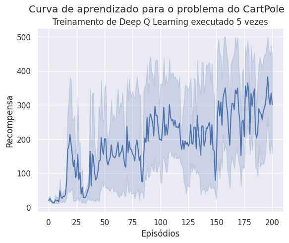

# Deep Reinforcement Learning (value-based method)

Segundo [Mnih,2013](http://arxiv.org/abs/1312.5602), desenvolver agentes que aprendem a atuar em um ambiente de alta dimensionalidade sempre foi um desafio para soluções baseadas em aprendizagem por reforço. Até 2013, a maioria das aplicações de aprendizagem por reforço operavam nestes domínios com base em atributos determinados manualmente pelo projetista.

Os algoritmos Q-Learning e Sarsa representam as funções valor como tabelas. Durante o aprendizado a atualização dos valores $Q(s_{i}, a_{i})$ é feita somente para um estado específico, mantendo todas as outras estimativas inalteradas. Esta falta de capacidade dos modelos tabulares de generalizar, ou seja, de atualizar sua estimativa de valor para estados similares mas não idênticos aos estados encontrados, torna os algoritmos de aprendizagem por reforço baseados em tabelas impraticáveis para tarefas mais complexas com espaços de estados e ações maiores.
	
Em [Mnih,2013](http://arxiv.org/abs/1312.5602) os autores do artigo propõe uma variante do algoritmo Q-Learning ([Watkins,1992](https://doi.org/10.1007/BF00992698)) onde os pesos de uma rede neural são treinados no lugar de uma Q-table.

## Q-Learning

Na figura abaixo é apresentado o pseudo-código do algoritmo Q-Learning. Neste pseudo-código é possível ver como os pares *Q(s,a)* são atualizados repetidas vezes através nas inúmeras interações do agente com o ambiente.


A versão em Python para este pseudo-código é bem direta: 

````python
def train(self):
        
    for i in range(1, self.episodes+1):
        (state,_) = self.env.reset()
        reward = 0
        done = False

        while not done:
            action = self.select_action(state)
            next_state, reward, done, _, _ = self.env.step(action) 
        
            # ajustando os valores da q-table
            old_value = self.q_table[state, action]
            next_max = np.max(self.q_table[next_state])
            new_value = old_value + self.alpha * (reward + self.gamma * next_max - old_value)
            self.q_table[state, action] = new_value
                
            state = next_state
            
        if self.epsilon > self.epsilon_min:
            self.epsilon = self.epsilon * self.epsilon_dec

    # persistindo a q-table
    savetxt(filename, self.q_table, delimiter=',')
    
    return self.q_table
````

Incluindo o método para seleção (*e-greedy*) da ação durante a etapa de treinamento: 

````python
def select_action(self, state):
    rv = random.uniform(0, 1)
    if rv < self.epsilon:
        return self.env.action_space.sample() # explorando o espaco
    return np.argmax(self.q_table[state]) # utilizando os valores aprendidos
````

Quando *S* e *A* são conjuntos finitos e não tão grandes então é fácil a utilização do algoritmo Q-Learning para determinar os valores de uma tabela 2D. Por exemplo, considere os ambientes do *TaxiDriver* e *BlackJack*: 

````python
>>> import gym
>>> env = gym.make("Taxi-v3").env
>>> env.action_space
Discrete(6)
>>> env.observation_space
Discrete(500)
>>>
>>> env = gym.make("Blackjack-v1")
>>> env.action_space
Discrete(2)
>>> env.observation_space
Tuple(Discrete(32), Discrete(11), Discrete(2))
````

No caso do *TaxiDriver*, teremos uma tabela de 500 estados versus 6 ações. E no caso do *BlackJack*, teremos uma tabela de 704 (32 * 11 * 2) estados versus 2 ações. 

Em algumas situações a descrição dos estados é contínua. Por exemplo, no caso do *MountainCar* o estado é representado pela posição do carro no eixo *X* e a sua velocidade. Ambos os valores são contínuos, como pode ser visto abaixo: 

````python
>>> env = gym.make('MountainCar-v0').env
>>> env.observation_space
Box([-1.2  -0.07], [0.6  0.07], (2,), float32)
>>> env.action_space
Discrete(3)
````

Neste caso, uma abordagem possível é discretizar estes valores como feito abaixo: 

````python
>>> num_states = (env.observation_space.high - env.observation_space.low)*np.array([10, 100])
>>> num_states = np.round(num_states, 0).astype(int) + 1
>>> num_states
array([19, 15])
````

Assim, para este caso temos uma tabela 3D com as seguintes dimensões 19 x 15 x 3. Claro que neste caso a implementação terá que sofrer alguns ajustes. 

No entanto, outros ambientes podem ter um espaço de estados ainda mais complexo, como por exemplo: *CartPole*, *LunarLander* e os ambientes do *Atari*. 

````python
>>> env = gym.make('CartPole-v0').env
>>> env.observation_space
Box([-4.8000002e+00 -3.4028235e+38 -4.1887903e-01 -3.4028235e+38], [4.8000002e+00 3.4028235e+38 4.1887903e-01 3.4028235e+38], (4,), float32)
>>> env = gym.make('LunarLander-v2').env
>>> env.observation_space
Box(-inf, inf, (8,), float32)
>>> env.action_space
Discrete(4)
````

No caso dos ambientes do *Atari* tem-se uma representação correspondente a imagens RGB. Quanto mais complexa a representação dos estados, mais difícil é a identificação correta e codificação dos atributos para gerar a Q-table. Então, por que não deixar esta tarefa a cargo de uma rede neural? 

## Deep Reinforcement Learning


Para implementar a versão proposta por [Mnih,2013](http://arxiv.org/abs/1312.5602) podemos usar uma rede neural qualquer, como a definida abaixo: 

````python
model = Sequential()
model.add(Dense(512, activation=relu, input_dim=env.observation_space.shape[0]))
model.add(Dense(256, activation=relu))
model.add(Dense(env.action_space.n, activation=linear))
````

No entanto, dois itens são importantes: 

* o número de entradas é o tamanho do espaço de observação, e;
* o número de saídas é igual ao número de ações. 

Porque o objetivo desta rede neural é identificar a melhor ação para um determinado estado. A seleção da melhor ação acontece desta maneira: 

````python
action = self.model.predict(state)
return np.argmax(action[0])
````
onde `action[0]` é um vetor com o tamanho igual as ações que o agente sabe executar. 

Desta forma, a função *e-greedy* é definida de tal forma: 

````python
def select_action(self, state):
    if np.random.rand() < self.epsilon:
        return random.randrange(self.env.action_space.n)
    action = self.model.predict(state)
    return np.argmax(action[0])
````

A *loss function* usada para treinar a rede neural é a *mean squared error* (MSE): 

$\mathcal{L}(\theta) = (y^{t} - Q(s^{t}, a^{t}; \theta))^{2}$

entre o reward acumulado $y^{t}$ e o valor estimado pela rede neural $Q(s^{t}, a^{t}; \theta)$.

### Pseudo-código

Abaixo é apresentado o pseudo-código do algoritmo proposto por [Mnih,2013](http://arxiv.org/abs/1312.5602):


### Experience replay

A forte correlação entre as amostras consecutivas usadas para atualizar a função de valor leva a um *overfitting* indesejável da rede com os exemplos mais recentes.

[Mnih,2013](http://arxiv.org/abs/1312.5602) propõe o uso de uma técnica chamada *experience replay*, que consiste em armazenar as experiências do agente em cada momento $e_{t} = (s_{t}, a_{t}, r_{t}, s_{t+1})$ em um dataset $D = e_{1}, \cdots, e_{N}$. 

Aprender diretamente a partir de exemplos consecutivos é ineficiente devido a alta correlação entre os exemplos. Desta forma, o treinamento do modelo considera uma amostra aleatória retirada de $D$. 

A criação do dataset $D$ pode ser feita desta forma:

````python
def experience(self, state, action, reward, next_state, terminal):
    self.memory.append((state, action, reward, next_state, terminal)) 
````

E o *experience replay* desta forma:

````python
def experience_replay(self):
    # soh inicia o processo antes de ter uma memoria minima
    if len(self.memory) > self.batch_size:
        # faz a escolha aleatoria dos exemplos
        batch = random.sample(self.memory, self.batch_size) 
        states = np.array([i[0] for i in batch])
        actions = np.array([i[1] for i in batch])
        rewards = np.array([i[2] for i in batch])
        next_states = np.array([i[3] for i in batch])
        terminals = np.array([i[4] for i in batch])

        # np.squeeze(): Remove single-dimensional entries from the shape of an array.
        # Para se adequar ao input
        states = np.squeeze(states)
        next_states = np.squeeze(next_states)

        # usando o modelo para selecionar o valor das melhores acoes
        next_max = np.amax(self.model.predict_on_batch(next_states), axis=1)
            
        targets = rewards + self.gamma * (next_max) * (1 - terminals)
        targets_full = self.model.predict_on_batch(states)
        indexes = np.array([i for i in range(self.batch_size)])
        targets_full[[indexes], [actions]] = targets

        # recalculando os pesos da rede
        self.model.fit(states, targets_full, epochs=1, verbose=0)
            
        if self.epsilon > self.epsilon_min:
            self.epsilon *= self.epsilon_dec
````

Preste atenção neste update da rede neural: 

```python
targets = rewards + self.gamma * (next_max) * (1 - terminals)
```

este código está implementando esta equação:


<!--
As ações em um estado terminal tem todas valor zero. Quando implementamos o algoritmo Q-Learning, iniciamos a Q-table com zeros, desta forma não precisamos nos preocupar com os valores das ações em um estado terminal. No entanto, quando usamos uma rede neural, temos que garantir que as ações em um estado terminal tem valor zero.
-->

### Loop de treinamento

O loop principal de treinamento tem este comportamento:

````python
def train(self, max_steps):
    rewards = []
    for i in range(self.episodes+1):
        state = self.env.reset()
        state = np.reshape(state, (1, self.env.observation_space.shape[0]))
        score = 0
        for _ in range(max_steps):
            action = self.select_action(state)
            self.env.render()
            next_state, reward, terminal, _ = self.env.step(action)
            score += reward
            next_state = np.reshape(next_state, (1, self.env.observation_space.shape[0]))
            self.experience(state, action, reward, next_state, terminal)
            state = next_state
            self.experience_replay()
            if terminal:
                print(f'Episódio: {i+1}/{self.episodes}. Score: {score}')
                break
        rewards.append(score)    
    return rewards
````

## Exemplo de uso: CartPole

Podemos verificar o funcionamento deste algoritmo com o ambiente `CartPole` da biblioteca `Gymnasium` executando: 

````bash
python CartPole.py
````

Para a execução deste arquivo serão necessários os arquivos: 

- [CartPole.py](./src/CartPole.py)
- [DeepQLearning.py](./src/DeepQLearning.py)

**Importante**: 

- Antes de executar o arquivo `CartPole.py` você vai ter que instalar o pacote `tensorflow` visto que agora a implementação está usando `tensorflow` e `keras`.
- Você também deverá criar dois diretórios: `results` e `data` na raiz do projeto. Em `results` serão salvos os dados para imprimir a curva de aprendizado e em `data` os pesos da rede neural. 

Espera-se que o resultado da curva de aprendizado seja similar a este: 

 

ou este: 

 

O algoritmo Deep Q Learning foi configurado com os seguintes hiperparâmetros:

```python
gamma = 0.99 
epsilon = 1.0
epsilon_min = 0.01
epsilon_dec = 0.99
episodes = 200
batch_size = 64
learning_rate=0.001
memory = deque(maxlen=10000)
```

Para o problema do CartPole foi necessário adicionar mais uma condição de parada: caso o agente realize 500 episódios sem cair, o episódio é finalizado.

### Será que este agente conseguiu aprender a controlar o CartPole?

Uma forma de testar isto é executando um script que faz uso da rede neural treinada: 

````bash
python CartPole_trained.py
````

Este script está disponível [aqui](./src/CartPole_trained.py).

## Implementação para o Mountain Car

Que tal implementarmos uma solução para o ambiente `MountainCar` e compararmos os resultados com a solução usando Q-Learning? 

Atividades sugeridas: 

1. Treine o agente usando Q-Learning para o ambiente `MountainCar` usando os melhores hiperparâmetros encontrados na atividade anterior.
1. Execute o treinamento $N$ vezes onde este $N$ precisa ser maior ou igual a 5.
1. Colete todos os dados para criar a curva de aprendizado.
1. Armazene os pesos da Q-table.
1. Implemente o Deep Q-Learning para o ambiente `MountainCar`.
1. Execute o treinamento $N$ vezes onde este $N$ precisa ser maior ou igual a 5.
1. Encontre os melhores hiperparâmetros para o Deep Q-Learning.
1. Colete todos os dados para criar a curva de aprendizado.
1. Armazene os pesos da rede neural.
1. Compare os resultados obtidos com o Q-Learning e o Deep Q-Learning usando um plot. Tente deixar claro no plot qual a meta de recompensa acumulada para o ambiente `MountainCar`.
1. Crie outro gráfico que mostra o desempenho de ambos os agentes durante o processo de inferência, ou seja, quando o agente está atuando sem treinamento. 

Todo o código necessário para esta atividade deve ser entrege no Github classroom [https://classroom.github.com/a/3cFWPdqG](https://classroom.github.com/a/3cFWPdqG) até o dia 11/03/2025. Esta é uma atividade individual. 