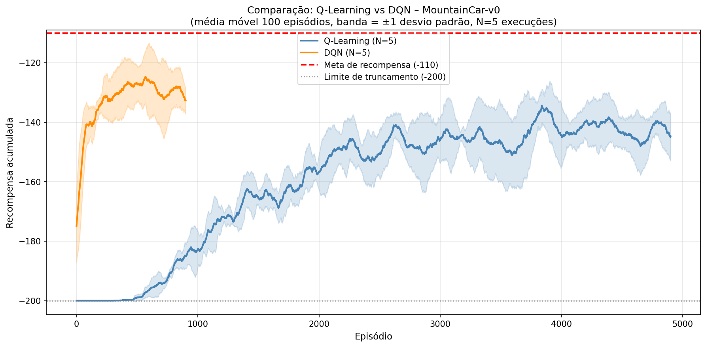
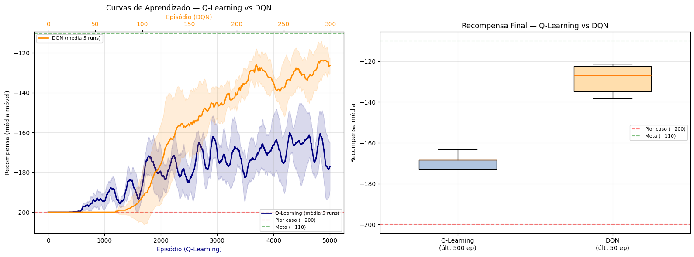

# Comentários sobre a implementação do Deep Q-Learning

O objetivo deste documento é apresentar comentários sobre a implementação do algoritmo Deep Q-Learning no ambiente `MountainCar-v0`.

O algoritmo utilizado neste exercício foi o Deep Q-Learning com uma única rede neural para a aproximação da função de valor $Q(s, a)$.
Além disso, o agente utiliza uma política $\epsilon$-greedy para a seleção de ações, onde $\epsilon$ é decaída ao longo do tempo para incentivar a exploração no início do treinamento e a exploração no final. A coleta de exemplos para treino da rede neural é feita utilizando a técnica de *experience replay*, onde as transições de estado, ação, recompensa e próximo estado são armazenadas em uma memória e amostradas aleatoriamente para o treinamento da rede.

Entre os trabalhos entregues, o que **melhor descreve os hiperparâmetros utilizados** foi [https://github.com/insper-classroom/05-dqn-anaparraf](https://github.com/insper-classroom/05-dqn-anaparraf).

Em [https://github.com/insper-classroom/05-dqn-GabrielGalazzi](https://github.com/insper-classroom/05-dqn-GabrielGalazzi) houve uma tentativa interessante de **explicabilidade da função $Q$** aprendida. 

A grande maioria dos trabalhos utilizou uma quantidade menor de episódios para treinar o agente usando Deep Q-Learning. O que é compreensível, dado o tempo de treinamento necessário para este algoritmo. No entanto, é importante salientar que uma parada de N episódios muito anterior ao necessário para o agente aprender a resolver o ambiente pode levar a um desempenho ruim do agente. Por exemplo, neste caso abaixo: 

## Gráfico que pode induzir ao erro de interpretação

O gráfico apresentado abaixo tem uma qualidade visual muito boa: 

No entanto, ele pode induzir a um erro de interpretação com relação ao número de episódios utilizados por cada algoritmo. 