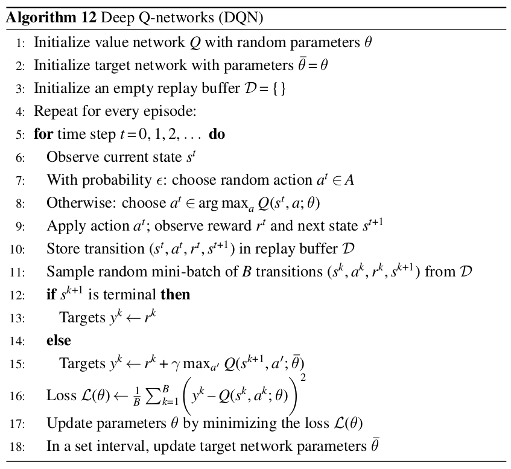

# Lunar Lander Project

Objetivo da atividade: implementar um agente capaz de controlar o *lunar lander* do ambiente `env = gym.make('LunarLander-v2')`. 

## Entrega básica

Sugestão de atividades: 

* Leia a documentação existente [neste link](https://gymnasium.farama.org/environments/box2d/lunar_lander/). 

* Implemente um agente capaz de controlar o *lunar lander* usando o algoritmo **Deep Q-Learning**. 

* Faça a persistência da rede neural para que depois a mesma possa ser utilizada por um outro script para pousar o *lunar lander* de forma correta. Ou seja, no seu projeto, além do script para treinamento, você também deverá entregar o script que faz uso do modelo treinado. 

* Para estes dois últimos itens você pode reutilizar o código de *Deep Q-Learning* implementado nas últimas aulas. Apenas preste atenção na estrutura da rede neural e nos hiperparâmetros.

* Na documentação do projeto você precisa:
    * descrever brevemente qual é o problema, qual é o *action space* e *observation space*;
    * apresentar a curva de aprendizado na forma de uma gráfico, e;
    * apresentar dois gifs animados: o primeiro com o comportamento do agente em uma situação intermediária do treinamento (ou seja, o agente em uma situação onde não sabe executar direito a tarefa) e o segundo com o comportamento do agente na situação final.

* Não esqueça de adicionar ao projeto o arquivo de `requirements.txt` com todas as bibliotecas necessárias para a execução do projeto. 

Ao entregar estes itens você tem garantido um **B**. 

## Entrega avançada com DQN

Para ter uma nota **A+** neste projeto você precisa: 

* Implementar a versão final do algoritmo **Deep Q-networks (DQN)** como apresentado no pseudo-código abaixo: 

 

Preste atenção em alguns pontos: 

1. Esta versão do algoritmo faz uso de duas redes (linha 1 e 2); 
1. Toda a escolha de ação acontece usando a *value network $\theta$* (linha 8); 
1. A recompença acumulada é calculada usando a *target network $\overline{\theta}$* (linha 15); 
1. O cálculo da função de perda é feito usando a *value network* (linha 16); O update dos parâmetros a cada episódio acontece somente na *value network $\theta$* (linha 17), e; 
1. A *target network* é atualizada a cada $C$ episódios (linha 18) - esta atualização é uma simples cópia dos pesos ($\overline{\theta} \leftarrow \theta$).

Espera-se que com o uso de duas redes neurais o aprendizado do agente seja mais estável. Ao utilizar apenas uma rede neural o aprendizado do agente pode ser instável porque a rede neural está estimando a função de valor e ao mesmo tempo está sendo atualizada.

* Comparar os resultados alcançados com o uso desta implementação versus a implementação de Deep Q-Learning que já temos disponível em termos de aprendizado do agente. 
* Na documentação do projeto você precisa adicionar esta análise.
* No projeto você precisa adicionar os scripts que você implementou. 
* Não esqueça de atualizar o arquivo de `requirements.txt`, se necessário. 

Você deve submeter o seu projeto neste link: [https://classroom.github.com/a/UNPTi8Dx](https://classroom.github.com/a/UNPTi8Dx) do Github Classroom. 

## Deadline

O deadline para a entrega desta atividade é **20 de março de 2024** (quinta-feira) às 23:30 horas. Este trabalho deve ser feito em grupo com até 4 integrantes.

<!--

## Exemplo de entrega completa :new: 

O projeto mais completo entregue em 2024/1 foi [este aqui](https://github.com/insper-classroom/08-lunar-lander-droneiros-de-cabreuva).

-->

