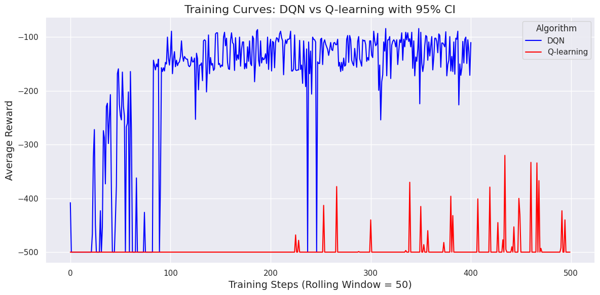
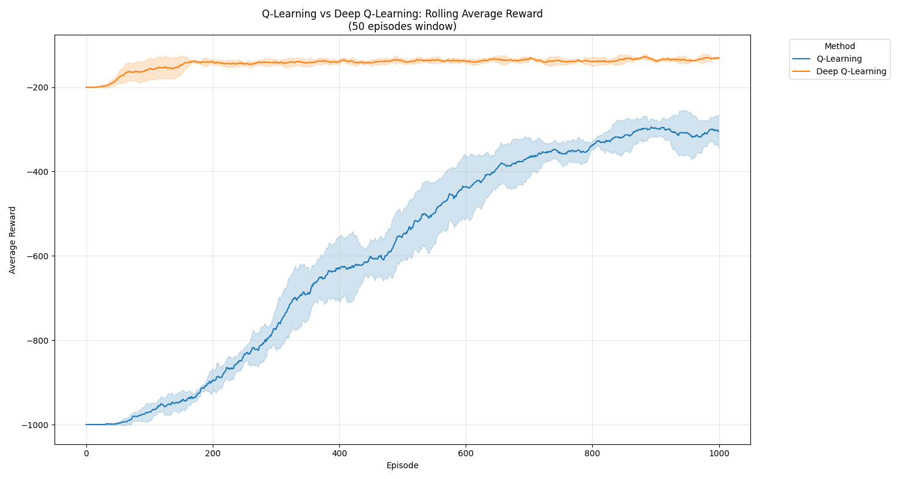
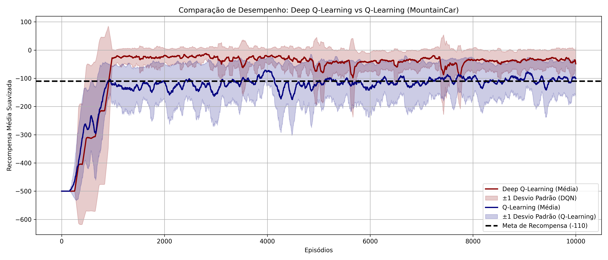
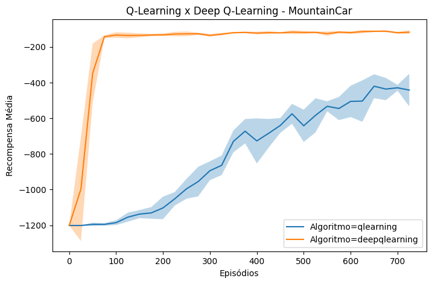
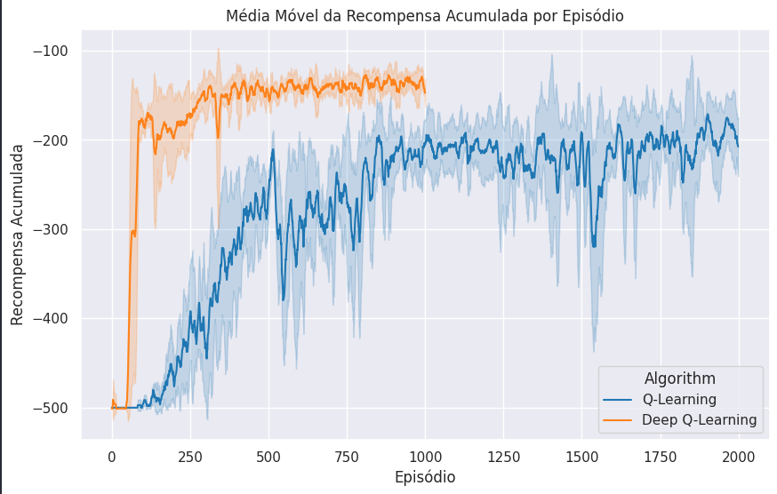
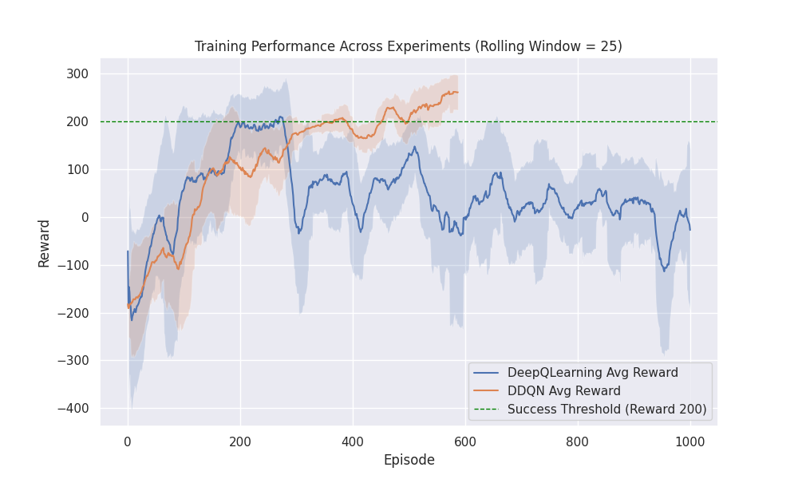
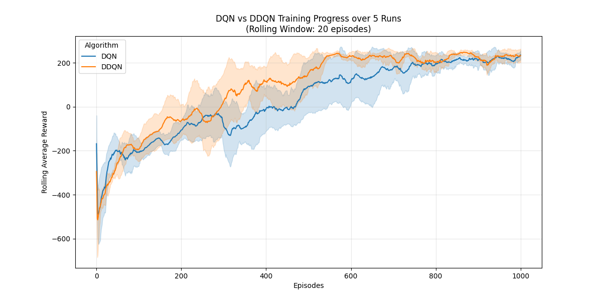

# Comentários sobre as últimas implementações

Nas últimas semanas foram feitas várias implementações que tinham como objetivos: 

1. compreender melhor como funcionam os algoritmos Deep Q-Learning e suas variantes, Reinforce e A2C. 
1. a dinâmica de treinamento de agentes em diferentes ambientes, tais como, Mountain Car, Cart Pole, Lunar Lander e Breakout.
1. exercitar técnicas para avaliar algoritmos e o aprendizado de agentes.
1. exercitar o uso de bibliotecas de algoritmos e ambientes. 

## Uso de DQN e Q-Learning no ambiente Mountain Car

Nem todos os resultados foram iguais aos apresentados abaixo:











Mas, algo que pode-se perceber é que o algoritmo DQN tem um desempenho superior. 

Os parâmetros que geraram curvas com um aprendizado mais rápido foram: 

| Modelos | Gamma | Epsilon | Epsilon mínimo | Epsilon decay | Episódios | Batch size | Learning rate | Memória de replay | Max steps |
|---------|-------|---------|----------------|---------------|-----------|------------|---------------|-------------------|-----------|
| Modelo1 | 0.99  |   1     |      0.01      |    0.995      |     1000  |     128    |     0.001     |      50000        |   2500    |
| Modelo2 | 0.99  |   1     |      0.01      |    0.999      |      700  |      64    |     0.0004    |                   |           | 
| Modelo3 | 0.99  |   1     |      0.01      |    0.995      |     2000  |      64    |     0.001     |      10000        |    500    |


## DDQN no ambiente Lunar Lander

O objetivo desta atividade era comparar as diversas versões do algoritmo DQN no ambiente Lunar Lander. Abaixo são apresentados alguns resultados obtidos:





Os hiperparâmetros utilizados nos dois casos foram: 

```python
gamma = 0.99
epsilon = 1.0
epsilon_min = 0.01
epsilon_dec = 0.0067
episodes = 1000
batch_size = 64
memory = deque(maxlen=10000) 
max_steps = 1000
alpha = 0.001
reward_avg_tol = 250
copy_nn = 100
```

A arquitetura da rede neural utilizada no primeiro caso foi: 

```python
class DQNModel(nn.Module):
    def __init__(self, input_dim, output_dim):
        super(DQNModel, self).__init__()
        self.fc1 = nn.Linear(input_dim, 512)  # First Dense layer
        self.fc2 = nn.Linear(512, 256)
        self.fc3 = nn.Linear(256, output_dim)  # Output layer

    def forward(self, x):
        x = F.relu(self.fc1(x))
        x = F.relu(self.fc2(x))
        return self.fc3(x)  # No activation on output (equivalent to linear activation)
```

Arquiteturas similares foram usadas em outras implementações. 

## DQN e A2C nos ambientes CartPole-v1, LunarLandar-v3 e Breakout

O objetivo desta atividade foi treinar agentes usando os algoritmos DQN e A2C para os ambientes CartPole-v1, LunarLandar-v3 e Breakout. 

Foram selecionados alguns repositórios que apresentaram uma implementação e análise mais completa: 

* [https://github.com/insper-classroom/08-dqn-vs-a2c-super_j_schulman](https://github.com/insper-classroom/08-dqn-vs-a2c-super_j_schulman)
* [https://github.com/insper-classroom/08-dqn-vs-a2c-p-j](https://github.com/insper-classroom/08-dqn-vs-a2c-p-j)
* [https://github.com/insper-classroom/08-dqn-vs-a2c-fruto_devontade_divina](https://github.com/insper-classroom/08-dqn-vs-a2c-fruto_devontade_divina)
* [https://github.com/insper-classroom/08-dqn-vs-a2c-catapimbas](https://github.com/insper-classroom/08-dqn-vs-a2c-catapimbas)

## Comparando os algoritmos DQN, A2C e PPO

No semestre passado foi feita uma atividade de comparação de algoritmos em diferentes ambientes. O objetivo desta atividade foi comparar o desempenho de diferentes algoritmos de reinforcement learning em diferentes ambientes. 

Os algoritmos comparados foram: 

* DQN
* A2C
* PPO

Foi utilizado as implementações da biblioteca [https://stable-baselines3.readthedocs.io/en/master/](https://stable-baselines3.readthedocs.io/en/master/).

Os ambientes que utilizados na comparação foram: 

* Bipedal Walker
* Car Racing, discreto e contínuo
* CartPole
* Lunar Lander

Foram utilizados os ambientes disponibilizados na biblioteca [https://gymnasium.farama.org/](https://stable-baselines3.readthedocs.io/en/master/)

O relatório final desta atividade pode ser visto neste [link](./analise_curva_aprendizado.html). O link para todo o repositório da atividade é [https://github.com/fbarth/rl_compare](https://github.com/fbarth/rl_compare).


