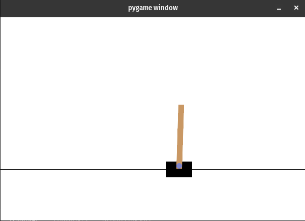

# Comments on Deep Q-Learning activities

Na última semana foram propostas a implementação de dois agentes `CartPole` e `LunarLander` usando o algoritmo Deep Q-Learning que é descrito neste [link](../15_deep_q_learning/index.md). Durante o treinamento destes dois agentes foram identificados alguns problemas. 

O primeiro problema está relacionado com o consumo de memória excessivo. Ao que tudo indica, com a nova versão do `tensorflow` o keras mantêm em memória alguma estrutura de dados toda vez que o `fit` é executado. Como no caso do algoritmo `DeepQLearning.py` o `fit` do keras é executado diversas vezes então temos um problema de *memory leak*.

Para resolver este problema foi adicionado ao final do `while` as seguintes instruções: 

```python
gc.collect()
keras.backend.clear_session()
```

Desta forma o consumo de memória fica estável. 

O segundo problema está relacionado com o critério de parada dos episódios. O código que foi disponibilizado levava em consideração uma versão antiga da biblioteca `gymnasium`, ainda quando ela se chamava `gym` e pertencia a OpenAI. Considerando a nova versão da biblioteca, a melhor definição para a condição de parada do episódio é esta: 

```python
done = False
steps = 0
score = 0
while not done:
    steps += 1
    action = self.select_action(state)
    next_state, reward, terminal, truncated, _ = self.env.step(action)
    if terminal or truncated or (steps>self.max_steps):
        done = True
    score += reward
    next_state = np.reshape(next_state, (1, self.env.observation_space.shape[0]))
    self.experience(state, action, reward, next_state, terminal)
    state = next_state
    self.experience_replay()
    if terminal:
        print(f'Episódio: {i+1}/{self.episodes}. Score: {score}')
        break
rewards.append(score)
gc.collect()
keras.backend.clear_session()
```

Neste caso, deixamos de considerar apenas o `terminal` e passamos a considerar também o `truncated` e a quantidade de `steps` máximos. Este último dado é informado via parâmetro via a variável `max_steps`, visto que cada ambiente tem um número diferente de `steps` máximos.

A nova versão do código está disponível em [https://github.com/Insper/rl_code/tree/main/src/part_06](https://github.com/Insper/rl_code/tree/main/src/part_06).

## Resultados esperados com a execução do CartPole

Ao treinar um agente para o ambiente `CartPole-v1` usando o algoritmo Deep Q-Learning com os seguintes hiperparâmetros: 

```python
gamma = 0.99 
epsilon = 1.0
epsilon_min = 0.01
epsilon_dec = 0.99
episodes = 200
batch_size = 64
memory = deque(maxlen=10000)
max_steps = 500
```

e com a seguinte rede neural: 

```python
model = Sequential()
model.add(Dense(512, activation=relu, input_dim=env.observation_space.shape[0]))
model.add(Dense(256, activation=relu))
model.add(Dense(env.action_space.n, activation=linear))
model.summary()
model.compile(loss='mse', optimizer=Adam(learning_rate=0.001))
```

tem-se uma curva de aprendizagem com a seguinte característica: 

<center>

</center>

e um agente treinado com o seguinte comportamento: 

<center>

</center>

## Resultados esperados com o Lunar Lander

Enquanto eu escrevia este documento e organizava os artefatos de código no repositório, eu deixei executando o treinamento do `LunarLander`. A estrutura da rede neural é a mesma da implementação do `CartPole`, exceto as camadas de entrada e saída - pois a forma como o estado é representado e a quantidade de ações neste caso é diferente. 

Os hiperparâmetros utilizados são estes: 

```python
gamma = 0.99 
epsilon = 1.0
epsilon_min = 0.01
epsilon_dec = 0.99
episodes = 1000
batch_size = 64
memory = deque(maxlen=500000) 
max_steps = 1500
```

O script está executando a aproximadamente 4 horas e o estado atual é: 

```bash
Episódio: 377/1000. Score: 276.2426303107534
Episódio: 378/1000. Score: 223.08010026072068
Episódio: 379/1000. Score: 254.1889026369425
Episódio: 380/1000. Score: 261.51268858418007
Episódio: 381/1000. Score: 259.86030828311556
Episódio: 382/1000. Score: 230.00523837249335
```

Ou seja, ainda falta 2/3 dos episódios para terminar o treinamento. Mas, aparentemente é apenas uma questão de tempo :blush: 

## Entrega do exercício

O escopo do exercício continua sendo o mesmo. No entanto, a data de entrega mudou para **13/04/2023**. 
