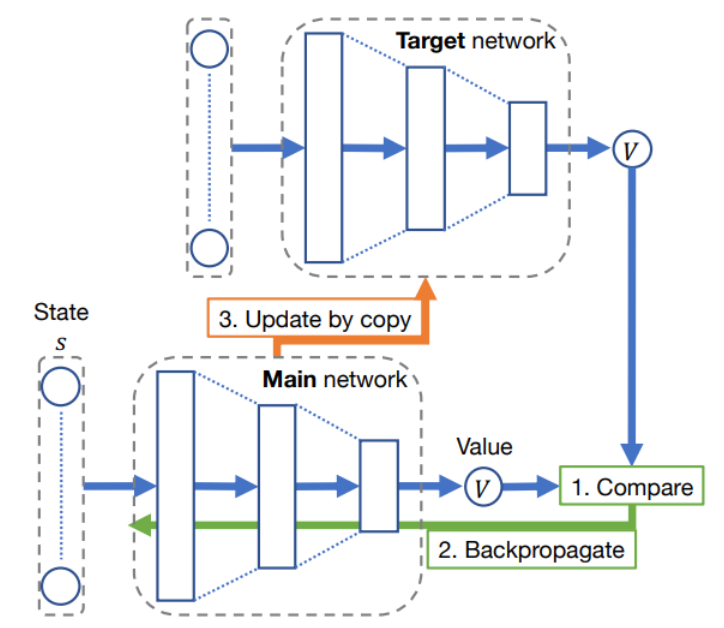

# Double Deep Q-Learning

Os objetivos desta seção são:

* discutir as definições e conceitos-chave relacionados ao Double Deep Q-Learning proposto por [van Hasselt, Guez e Silver (2016)](https://doi.org/10.1609/aaai.v30i1.10295);
* entender as diferenças entre DQN e Double Deep Q-Learning, e;
* implementar um algoritmo Double Deep Q-Learning e comparar os resultados com DQN.

As principais referências para esta atividade são:

* van Hasselt, H., Guez, A. and Silver, D. 2016. Deep Reinforcement Learning with Double Q-Learning. Proceedings of the AAAI Conference on Artificial Intelligence. 30, 1 (Mar. 2016). DOI: [https://doi.org/10.1609/aaai.v30i1.10295](https://doi.org/10.1609/aaai.v30i1.10295).

* Seção 8.1.5 do livro [Stefano V. Albrecht, Filippos Christianos, and Lukas Schäfer. Multi-Agent Reinforcement Learning: Foundations and Modern Approaches. MIT Press, 2024](https://www.marl-book.com/).

## Pre-work

Na [aula passada](../15_deep_q_learning_lunar_lander/index.md) implementamos uma versão simples do Deep Q-Learning para o ambiente `LunarLander-v2` e comparamos os resultados com a implementação do algoritmo DQN, também implementado em sala de aula. Ao comparar os resultados obtidos com DQN e Deep Q-Learning, esperamos uma curva de apresendizado similar a apresentada abaixo: 


Estas curvas de aprendizado foram obtidas utilizados os seguintes hiperparâmetros:

```python
gamma = 0.99 
epsilon = 1.0
epsilon_min = 0.01
epsilon_dec = 0.99
episodes = 1000
batch_size = 64
learning_rate=0.001
memory = deque(maxlen=10000)
ma_steps = 1500
```

A arquitetura da rede neural utilizada foi a mesma para ambos os algoritmos:

```python
model = Sequential()
model.add(Dense(512, activation=relu, input_dim=env.observation_space.shape[0]))
model.add(Dense(256, activation=relu))
model.add(Dense(env.action_space.n, activation=linear))
```

Foram executados 5 treinamentos para cada algoritmo.

Com os resultados obtidos, percebemos que o DQN é mais estável que o Deep Q-Learning. De acordo com a literatura, o DQN além de mais estável também converge mais rápido que o Deep Q-Learning.

O DQN é mais estável porque utiliza duas redes neurais: uma para estimar a função de valor e outra para calcular a recompensa acumulada. Além disso, também faz uso do conceito de experience replay. A imagem abaixo sumariza a relação entre as duas redes neurais: 



## Double DQN

O Double Deep Q-Learning proposto por [van Hasselt, Guez e Silver (2016)](https://doi.org/10.1609/aaai.v30i1.10295) é uma extensão do DQN que visa corrigir o problema de superestimação de valores de ação. Da mesma forma que o Q-Learning tradicional, o DQN também superestima os valores para os estados futuro através da equação: 

$y^{k} \leftarrow r^{k} + \gamma max_{a'} Q(s^{k+1}, a', \overline{\theta})$

A proposta do Double DQN é substituir a equação acima por: 


A ideia é separar a seleção da ação da estimativa de valor do estado. A seleção da ação é feita pela *value network* e a estimativa de valor é feita pela *target network*.

Escolha da ação: 

$bestA \leftarrow \arg \max_{a'}{Q(s^{t+1},a',\theta)}$

Estimativa de valor:

$r^{t} + \gamma Q(s^{t+1}, bestA, \overline{\theta})$

## Questões

Segundo a literatura, o Double DQN não super valoriza o valor dos estados futuros. De fato, fornece estimativas mais realistas dos valores de ação. Isto tem algum impacto no aprendizado do agente? O aprendizado converge mais rápido? O aprendizado é mais estável? 

[Ver enunciado do projeto intermediário](../../projects/projeto_intermediario/index.md).