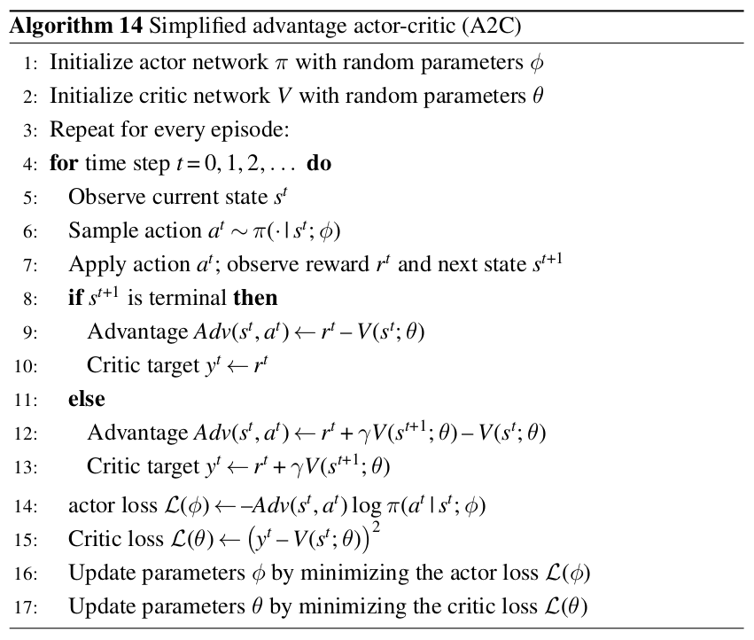
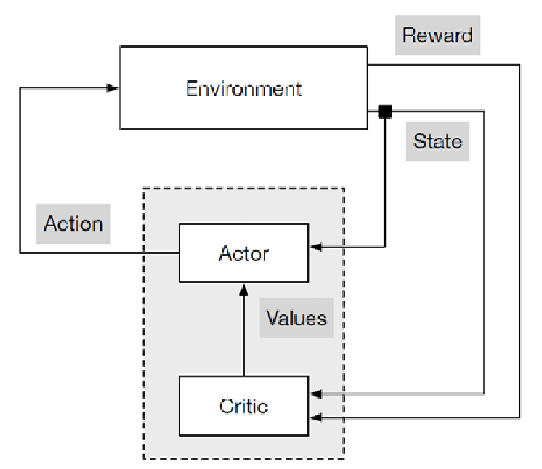

# A2C: Advantage Actor-Critic

No artigo original de Mnih et al. (2016), os autores propõem um algoritmo de aprendizado por reforço chamado A2C (Advantage Actor-Critic). Os autores também propõe o conceito de vantagem, que é uma medida de quão melhor é uma ação em relação a outra. 

## Vantagem

A vantagem é calculada como a diferença entre o retorno esperado de uma ação e o valor do estado atual. 

$Adv^{\pi}(s,a) = Q^{\pi}(s,a) - V^{\pi}(s)$

onde $Q^{\pi}(s,a)$ é o retorno esperado de uma ação $a$ em um estado $s$ seguindo uma política $\pi$, e $V^{\pi}(s)$ é o valor do estado $s$ seguindo a política $\pi$.

A vantagem pode ser entendida como quantificar o quanto mais alto é o retorno esperado ao aplicar a ação específica $a$ em comparação com seguir a política $\pi$ no estado $s$.

A interpretação da vantagem pode ser usada para guiar a otimização da política. Para uma vantagem positiva, devemos aumentar a probabilidade da política $\pi$ selecionar a ação $a$ no estado $s$; e devemos diminuir a probabilidade da política $\pi$ selecionar a ação $a$ no estado $s$ sempre que a vantagem for negativa.

## A2C

O método de ator-critic é uma abordagem que combina um ator, que é responsável por escolher ações, e um crítico, que é responsável por avaliar as ações escolhidas. 

<center>

</center>

Uma forma visual de entender o funcionamento do algoritmo é apresentada abaixo: 

<center>

</center>

Onde **Actor** é do tipo *policy gradient* e **Critic** é do tipo *value function* ou *value based*.

## Sugestão de atividade

Utilize a implementação do A2C disponível na biblioteca [stable-baselines3](https://pypi.org/project/stable-baselines3/) para treinar um agente que consegue atuar nos ambientes [CartPole-v1](https://gymnasium.farama.org/environments/classic_control/cart_pole/) e [LunarLander-v2](https://gymnasium.farama.org/environments/box2d/lunar_lander/). 

A implementação é direta. No entanto, exige alguns cuidados. A biblioteca stable-baseline3 possui o seu próprio ambiente. O escopo desta atividade não inclui o uso dos ambientes da biblioteca stable-baseline3. Você deve utilizar o ambiente Gymnasium para esta atividade.

Segue exemplo de código

```python
from stable_baselines3 import PPO, DQN, A2C
import gymnasium as gym
from stable_baselines3.common.logger import configure
from stable_baselines3.common.evaluation import evaluate_policy

tmp_path = "./results/"
new_logger = configure(tmp_path, ["stdout", "csv", "tensorboard"])

env = gym.make("CartPole-v1")
model = A2C(policy = "MlpPolicy", env = env)

model.set_logger(new_logger)
model.learn(total_timesteps=100_000)

mean_reward, std_reward = evaluate_policy(model, model.get_env(), n_eval_episodes=10)
print(f'Mean reward: {mean_reward} +/- {std_reward:.2f}')

print('modelo treinado')
env = gym.make("CartPole-v1", render_mode='human')
(obs,_) = env.reset()
for i in range(1000):
    action, _state = model.predict(obs, deterministic=True)
    obs, reward, done, truncated, info = env.step(action)
    env.render()
    if done:
      obs = env.reset()
```

* Entenda o funcionamento do código acima. 
* Analise os logs gerados. É possível a partir deste log criar as curvas de aprendizado?
* O comportamento do agente treinado é adequado? 
* Leia a documentação em [https://stable-baselines3.readthedocs.io/en/master/modules/a2c.html](https://stable-baselines3.readthedocs.io/en/master/modules/a2c.html) e tente modificar os hiperparâmetros do modelo para melhorar o desempenho do agente.
* A mesma biblioteca possui uma implementação de DQN. A documentação está disponível em [https://stable-baselines3.readthedocs.io/en/master/modules/dqn.html](https://stable-baselines3.readthedocs.io/en/master/modules/dqn.html). Compare o desempenho do A2C com o DQN. Qual dos dois algoritmos é mais eficiente para resolver o problema do CartPole-v1? E para o LunarLander-v2?

## Questões adicionais

* O ambiente que você escolheu para o projeto final da disciplina respeita a interface do Gymnasium? Se sim então é possível utilizar a biblioteca stable-baselines3 para treinar um agente para o seu ambiente.

Outros ambientes com implementações já prontas que podem ser úteis são: 

* [https://tianshou.org/en/stable/](https://tianshou.org/en/stable/)
* [https://marllib.readthedocs.io/en/latest/](https://marllib.readthedocs.io/en/latest/)


## Referências

* Volodymyr Mnih, Adrià Puigdomènech Badia, Mehdi Mirza, Alex Graves, Tim Harley, Timothy P. Lillicrap, David Silver, and Koray Kavukcuoglu. 2016. Asynchronous methods for deep reinforcement learning. In Proceedings of the 33rd International Conference on International Conference on Machine Learning - Volume 48 (ICML'16). JMLR.org, 1928–1937.

* Antonin Raffin, Ashley Hill, Adam Gleave, Anssi Kanervisto, Maximilian Ernestus, and Noah Dormann. 2021. Stable-Baselines3: Reliable Reinforcement Learning Implementations. Journal of Machine Learning Research 22, 268 (2021), 1–8. Retrieved from http://jmlr.org/papers/v22/20-1364.html

* OpenAI Baselines: ACKTR & A2C. Disponível em [https://openai.com/research/openai-baselines-acktr-a2c](https://openai.com/research/openai-baselines-acktr-a2c).