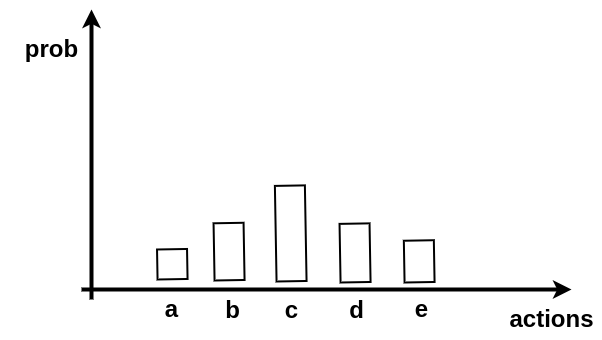
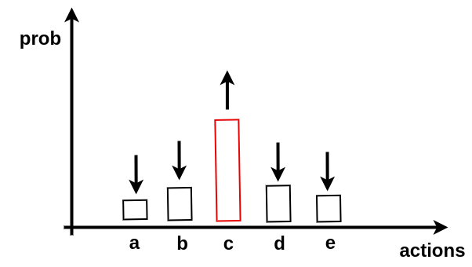

<style>
	footer {
		position: fixed;
		bottom: 10px;
		left: 950px;
		width: 400px;
	}

	footer img {
		vertical-align: middle;
	}

</style>


Policy Optimization
===

Disciplina de Reinforcement Learning
Professor: Fabrício Barth
E-mail para contato: fabriciojb@insper.br

-----

Objetivos desta aula
===

Ao final desta aula, você será capaz de: 

* entender a diferença entre os algoritmos da família **policy optimization** e os algoritmos da família **Q-learning**, e; 

* compreender como funciona e como implementar os algoritmos **policy gradient** e **proximal policy optimization**;

-----

Policy Gradient ou Reinforce
===

O algoritmo REINFORCE é um algoritmo que ao invés de definir uma *policy* em termos de $\pi(s) = \arg \max_{a} Q(s,a)$, como é feito com o Q-Learning e Deep Q-Learning, ele define a *policy* no formato de uma distribuição: 

$$
a_{t} \sim \pi_{\theta}(a_{t} | s_{t})
$$

onde $\theta$ representa os parâmetros da *policy* e a ideia é atualizar estes parâmetros usando um gradiente ascendente para **maximizar** a expectativa de *reward* futuro.

-----

# 

-----

Se durante a experiência do agente, o mesmo percebe que uma ação tem *reward* positivo (por exemplo, a ação *c*) então...

# 

-----

Policy Gradient ou Reinforce
===

$$
\theta_{0}
$$

```latex
def train(policy \theta_{0})
```

Input: 
    * parâmetros iniciais da policy $\theta_{0}$
    * taxa de aprendizado $\alpha > 0$

Para cada episódio:
    * 


-----

Referências
===

* Williams, R.J. Simple statistical gradient-following algorithms for connectionist reinforcement learning. Machine Learning 8, 229–256 (1992). https://doi.org/10.1007/BF00992696

-----

