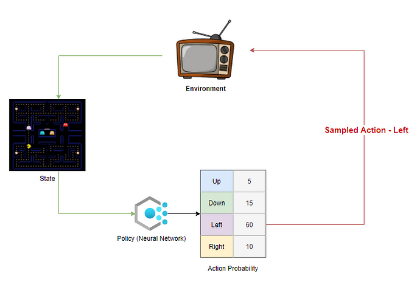
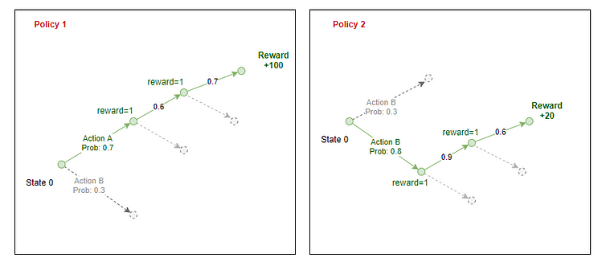

# Algoritmo REINFORCE

O algoritmo REINFORCE [^1] é um algoritmo que ao invés de definir uma *policy* em termos de $\pi(s) = \arg \max_{a} Q(s,a)$, como é feito com o Q-Learning e Deep Q-Learning, ele define a *policy* no formato de uma distribuição: 

$$
a_{t} \sim \pi_{\theta}(a_{t} | s_{t})
$$

onde $\theta$ representa os parâmetros da *policy* e a ideia é atualizar estes parâmetros usando um gradiente ascendente para **maximizar** a expectativa de *reward* futuro. Em outras palavras, o que queremos aprender neste caso é uma distribuição que leva o agente para um cenário onde ele irá maximar o *reward* futuro. 

Por exemplo, considere o cenário abaixo:

Cada *policy* gera uma probabilidade de escolher uma ação em cada estado do ambiente: 

O agente seleciona uma ação a partir desta distribuição de probabilidades. No fim de cada episódio, é conhecido o total de *rewards* que o agente pode conseguir se seguir aquela *policy*. O algoritmo de REINFORCE executa uma rotina de *backpropagation* pelo caminho que o agente escolheu para calcular o *reward esperado* em cada estado para uma política dada: 

## Referências

[^1]: Williams, R.J. Simple statistical gradient-following algorithms for connectionist reinforcement learning. Mach Learn 8, 229–256 (1992). https://doi.org/10.1007/BF00992696
